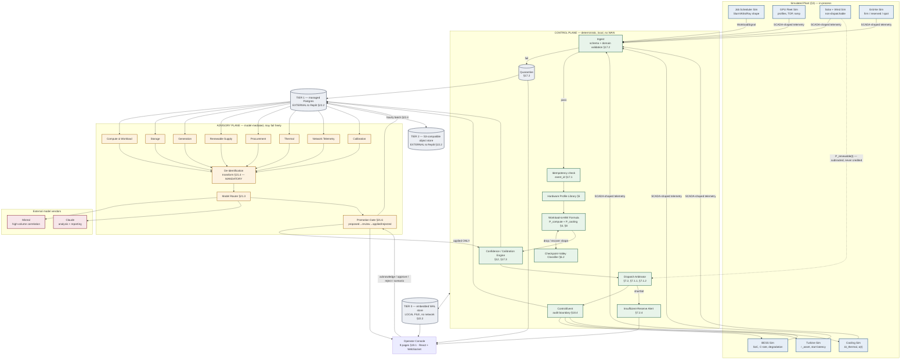
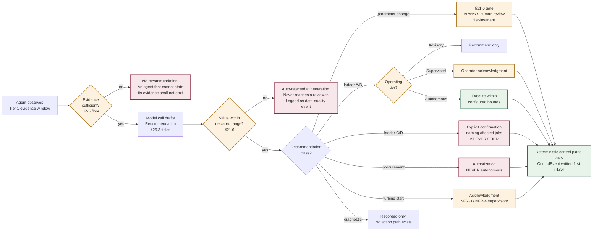
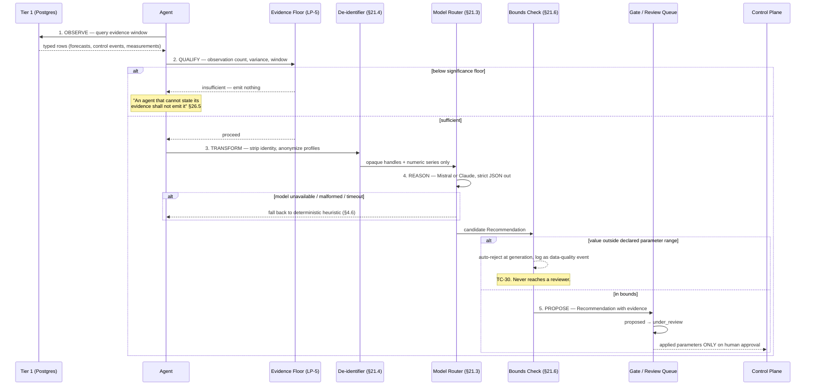
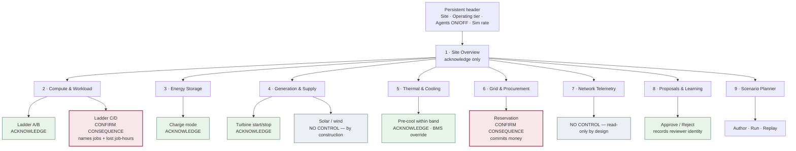
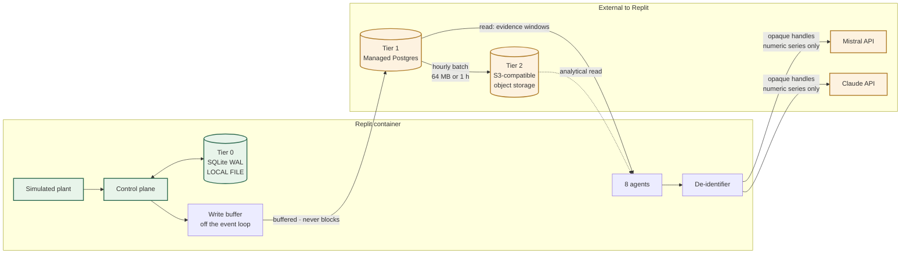

# GridSignal
## Agentic AI Prototype — Implementation Design Document

**Replit-hosted demonstration of the v2.5 control architecture with an advisory agent plane**

| Field | Value |
|---|---|
| Document status | Draft v0.1 — initial issue |
| Date | July 29, 2026 |
| Parent document | GridSignal Forecast Engine — Functional Specification, v2.5 |
| Related | GridSignal Simulator Functional Specification; GridSignal Replit Build Plan |
| Traceability | Implements Sec 4–12 (control plane), Sec 21 (learning plane), Sec 22 (persistence), Sec 26 (agents), Sec 19 (console) |
| Audience | Engineering (build team), QA/Test, Product, investor-facing stakeholders (Sec 10.4) |
| Owner | Prototype workstream |
| Scope posture | Demonstration prototype. No real hardware, no design-partner telemetry, no customer data |

---

## 0. Document Control

### 0.1 What this document is

This is an implementation design for a working prototype that demonstrates the GridSignal v2.5 architecture end to end: simulated physical plant, the deterministic forecast and dispatch control plane, an advisory plane of LLM-backed domain agents, and an interactive operator console — all runnable on Replit against databases that live outside Replit.

It is a build specification. Every component described here is intended to be implemented, and the acceptance criteria in Section 7 are intended to be executed rather than admired.

### 0.2 What this document is not

It is not an amendment to v2.5. Where this document appears to change a rule in the parent specification, that is a defect in this document unless it appears in the deviation register at 0.4 with an explicit rationale. Four items in Section 9.3 are proposed as amendments to v2.5 and are marked as such; they are not in force until v2.5 adopts them.

### 0.3 The governing constraint, stated once

The prototype has one architectural rule from which every other decision in this document follows, and it is inherited unchanged from v2.5 §21.1 and §26.1:

> **No model inference sits inside the real-time control path. No agent dispatches.**
>
> Agents monitor, correlate, diagnose, and propose. Every agent output is a `Recommendation` record; none is a command. What causes physical action is the authority gate the recommendation passes through. The agent proposes; the gate disposes; the deterministic control plane acts.

A prototype that violates this rule demonstrates a different product than the one v2.5 specifies, and demonstrates it to exactly the audience — investors and engineering partners — whose first serious question will be about determinism, auditability, and vendor dependence. The rule is therefore load-bearing for the demo, not merely inherited compliance.

### 0.4 Deviation register: requested design vs. v2.5 constraints

The originating request contains eight requirements that conflict with v2.5. Each is resolved below rather than silently accommodated or silently dropped. The resolution column is what this document actually specifies.

| # | As requested | Conflicting v2.5 constraint | Resolution in this design |
|---|---|---|---|
| D-1 | Agents use Mistral/Claude for rule-based reasoning, e.g. *"if GPU workload > 80%, request additional battery power"* | §21.1 (no inference in control path); §26.1 (agents never dispatch). The quoted rule is a §7.2 dispatch arbitration decision | The quoted rule is implemented as deterministic arithmetic in the control plane (§1.2, §4.1). LLMs are used for the four workstreams §21.2 actually names — pattern discovery, cost attribution, error attribution, narrative reporting — and for agent recommendation drafting. **No LLM call gates a dispatch decision.** |
| D-2 | "Optimization algorithms (e.g. linear programming) via LLM" | §26.4 — inter-agent selection is a specified deterministic ranking, "because selecting the response to a predicted shortfall is control-adjacent" | Arbitration ranking is a hard-coded ordering function (§1.6). LP-style optimization, where used, runs as a deterministic solver in the advisory plane over a bounded horizon and produces a `Recommendation`, never a setpoint |
| D-3 | Replit-independent databases; PostgreSQL / MongoDB / **Firebase**; "low-latency access and horizontal scalability for high concurrency" | §22.1 principle 1 and §22.6 — *networked stores of any kind* are excluded from the control path; §22.7 requires the simulator's control-plane store to be a local file | **Tier 0 stays local** (embedded WAL'd SQLite in the Replit container). **Tier 1 and Tier 2 are external and Replit-independent** — managed Postgres and S3-compatible object storage. This satisfies the intent of the requirement (no state trapped in Replit) without putting a WAN hop behind a dispatch decision. MongoDB and Firebase are rejected for Tier 1 with reasons at §6.6 |
| D-4 | Validation metric: **"100% LLM uptime"** | LP-1 (§21.1) — loss of every model vendor shall not degrade the control plane. TC-28 tests this | Inverted. The metric is **0% control-plane dependence on model availability**, measured by TC-28 and TC-48. LLM uptime is tracked as a service-quality metric with no acceptance threshold attached (§7.4) |
| D-5 | Validation metric: "agent response time < 100 ms" | §21.1 latency table — the learning plane budget is *seconds to minutes, no hard bound* | Split into two metrics with different owners: **control tick ≤ 250 ms p99 and decision-to-command ≤ 2 s p99** (NFR-2), and **agent recommendation latency ≤ 20 s p95**, which is a UX target, not a safety one (§7.4) |
| D-6 | "Containerization (e.g. Docker) for isolation" on Replit | Environmental. Replit's standard workflow is Nix-based; arbitrary Docker daemons are not the supported path | Nix module manifest as the primary reproducibility mechanism, with a maintained `Dockerfile` that is **not used by Replit** but makes the prototype portable off it (§5.1, §5.4). Recorded honestly rather than claimed |
| D-7 | Agent types include a **wind** power source | v2.5 models solar PV only (§7.1.1). Wind appears nowhere | Wind is added to the *simulator* as a second non-dispatchable source under identical §7.1.1 treatment (input, never a setpoint; never credited toward ramp capability). Proposed as spec amendment **PA-2** (§9.3) |
| D-8 | Stakeholder claim: *"autonomous agents reduce manual intervention by 80%"* | No evidence exists for this figure. v2.5's discipline throughout is that placeholder numbers are labelled as placeholders | **Not asserted.** §10.4 states what the prototype can actually demonstrate and what would be required to substantiate an intervention-reduction claim. Fabricating a metric in front of a technical investor is a larger risk than omitting one |

### 0.5 One prior decision this design reverses

An earlier prototype decision selected a single-process Replit app with asyncio concurrency and **no external cloud services**, after considering and rejecting a multi-cloud, LLM-agent-per-resource design. This document reverses the second half of that decision — Tier 1 and Tier 2 now sit outside Replit — because v2.5 §22.2 has since specified those tiers as external and §22.7 explicitly permits the collapse only for Tiers 0/1.

The first half of that decision **stands and is reinforced**: this remains a single process with asyncio concurrency. The agents are asyncio tasks in that process, not separate services. Section 1.7 explains why a message broker was considered and not adopted.

---

## 1. System Architecture

### 1.1 The two planes

Everything in the prototype belongs to exactly one of two planes, and the boundary between them is the most important line in the system. Influence crosses it in one direction only.

| | **Control plane** | **Advisory plane** |
|---|---|---|
| Sections implemented | v2.5 §4–§12, §17, §22.3, §23.3 arithmetic | v2.5 §21, §26, §27, plus scenario analytics |
| Determinism | Required. Reproducible from persisted inputs | Not required. Model-mediated and non-deterministic |
| Latency budget | 5 s tick (§3.1); ≤ 2 s decision-to-command (NFR-2) | Seconds to minutes; no hard bound |
| State store | Tier 0 only — local, embedded, WAL'd | Tier 1 and Tier 2 — external Postgres and object storage |
| External network | **None.** No WAN dependency of any kind | Postgres, object storage, Mistral API, Claude API |
| Output | `DispatchPlan` → `ControlEvent` → simulated asset | `Recommendation` / `Proposal` → review queue |
| On failure of the other plane | Runs indefinitely on last-applied parameter set | Backfills from persisted history on recovery |

The prototype makes this boundary visible as a demo feature rather than an implementation detail: the console carries a **Kill Agents** control (§2.6) that halts every agent and every model client. Dispatch behaviour must not change. That is TC-48, and it is the single most persuasive thing the prototype can show an engineering-literate investor.

### 1.2 Process topology

One Python process. Two asyncio task groups with different scheduling discipline.

```
gridsignal-prototype  (single Replit process)
│
├── ControlPlaneTaskGroup            ← never awaits a network call
│   ├── ingest_task                  §17.1–17.2  validation, dedupe, quarantine
│   ├── simulation_tick_task         §3.1        5 s tick + event-driven recompute
│   ├── forecast_task                §4, §5, §6, §8
│   ├── arbitration_task             §7.2, §7.1.1, §7.1.2, §23.3
│   └── tier0_writer_task            §22.2       embedded store, off-loop writes
│
├── AdvisoryPlaneTaskGroup           ← may await anything, bounded by timeout
│   ├── agent_supervisor             §26.2       8 agents, staggered cadences
│   ├── deident_transform            §21.4       mandatory egress filter
│   ├── model_router                 §21.3       Mistral / Claude / rule fallback
│   ├── proposal_gate                §21.6       four-state lifecycle
│   └── tier1_sync_task              §22.2       Postgres writes, buffered
│
└── InterfaceTaskGroup
    ├── fastapi_app                  REST control + scenario CRUD
    ├── ws_broadcaster               snapshot + delta, 4 Hz
    └── tier2_export_task            §22.4       hourly batch to object storage
```

**The scheduling rule that makes this safe.** No coroutine in `ControlPlaneTaskGroup` may `await` on anything whose completion depends on a socket. Tier 0 writes go through a bounded in-memory queue drained by `tier0_writer_task` (this is v2.5 §22.7's "store writes must not block the event loop", which is otherwise easy to violate and hard to diagnose — a synchronous embedded-store write shows up as forecast-path latency during NFR-2 load testing and gets misattributed).

Enforcement is mechanical rather than cultural: a `@control_plane` decorator instruments the coroutine and the test suite asserts that no control-plane coroutine's call graph reaches the HTTP client, the Postgres driver, or the model router (SIM-11, §7.2).

### 1.3 Agent inventory

v2.5 §26.2 defines seven agents. The prototype implements all seven and adds one, for the reason given in D-7.

| # | Agent | Simulated domain requested | Watches | Proposes | Authority ceiling (§26.2, §23.4, §24.3) |
|---|---|---|---|---|---|
| 1 | **Compute & Workload** | GPU resources | Job mix, node/accelerator allocation, curtailment eligibility, restoration cost | Curtailment ladder actions; hardware profile mapping gaps | Ladder A/B in Autonomous; **C/D never autonomous** |
| 2 | **Storage** | Battery capacitance | SoC, bridging capability vs forecast, cycle count, DoD, degradation, anchor duty | Charge scheduling within bounds; replacement forecasting; capacity re-rating | Charge scheduling at Supervised+; re-rating via §21.6 gate |
| 3 | **Generation** | Turbines | Online state, measured vs configured ramp rate, runtime hours, start reliability | Start/stop staging; `r_asset` recalibration; maintenance windows | **Advisory only.** A turbine start is supervisory control under NFR-3/NFR-4 |
| 4 | **Renewable Supply** *(new — PA-2)* | Solar, wind | Measured output vs forecast, string/inverter faults, irradiance and wind profile, forecast error on `P_renewable(t)` | Forecast-model corrections; availability de-rating; fault findings | **Advisory only, by construction.** No control surface exists — §7.1.1 |
| 5 | **Procurement** | Grid | Horizon forecast, price curve, held reservations, marginal generation cost | `ReservationProposal` (§24) | **Never autonomous, at any tier** (§24.3) |
| 6 | **Thermal** | Cooling plant | Measured α(t) and Δt_thermal vs model, CDU/pump health, approach temperature | α_max/τ/Δt_thermal recalibration; bounded pre-cooling setpoints | Advisory for anything the BMS owns; bounded pre-staging at Supervised+, never autonomous |
| 7 | **Network Telemetry** | Fabric | Throughput, link/optical health, prediction-to-traffic corroboration | Forecast-error attributions; integration-gap findings | **Advisory only. No dispatch path exists by construction** (§25.1) |
| 8 | **Calibration** | Cross-cutting | Rolling forecast error decomposed by profile, class, and tag | Parameter changes (α_max, τ, Δt_thermal, r_asset, profiles) | Via the §21.6 gate |

**Why there is no "solar agent" with controls.** The request lists solar and wind alongside GPU and battery as agent types, which implies symmetry that does not exist physically. Solar PV is a passive collector (§7.1.1); panel telemetry reports operational health, not a controllable setpoint. The Renewable Supply agent is therefore genuinely read-only, and the console page that surfaces it (§2.1, Page 4) carries no control. A page offering a control that does nothing is worse than a page offering none.

**Why Generation and Renewable Supply are separate agents** rather than one "power sources" agent, as requested: they have opposite relationships to the arbitration arithmetic. Turbine output is a term that *closes* a gap; renewable output is a term that *resizes* the gap and can never close one. Merging them invites an implementation in which `P_renewable` is credited toward ramp capability, which is the specific error §7.1.1 exists to prevent and which TC-33 tests for.

### 1.4 Autonomy: the degrees that actually exist

The request asks for agents to be classified as fully autonomous, semi-autonomous, or rule-based. That taxonomy does not map cleanly onto this architecture, because **no agent is autonomous at any level** — autonomy is a property of the operating tier applied to the deterministic control plane, not a property of an agent.

The accurate framing is an authority matrix. What varies is *what happens to a recommendation after it is made*.

| Recommendation class | Forecast / Advisory tier | Supervised tier | Autonomous tier |
|---|---|---|---|
| Parameter change (α_max, τ, Δt_thermal, r_asset, profile) | Queued for review | Queued for review | Queued for review — **the §21.6 gate does not relax with tier** |
| Curtailment ladder A/B | Recommend only | Requires operator acknowledgment | Executes within configured bounds |
| Curtailment ladder C/D | Recommend only | Explicit confirmation naming affected jobs | **Explicit confirmation regardless of tier** |
| Turbine start/stop | Recommend only | Acknowledgment | Acknowledgment — supervisory control under NFR-3/NFR-4 |
| Grid reservation (commits money) | Recommend only | Authorization | **Authorization. Never autonomous** (§24.3) |
| Pre-cooling setpoint within band | Recommend only | Bounded staging, BMS override | Bounded staging, BMS override. Never unbounded |
| Diagnostic finding (network, renewable fault) | Recorded | Recorded | Recorded — no action path exists |

Two properties of this matrix are worth stating for the demo narrative, because they are what distinguishes a defensible agentic control system from a demo that would fail a customer's safety review:

1. **The most consequential actions become *less* automatable, not more, as tier rises.** Ladder C/D and procurement have a hard human gate at every tier. There is no operating mode in which this system destroys a customer's completed work or spends their money without a person deciding that it should.
2. **The parameter gate is tier-invariant.** A site running in Autonomous tier still queues every calibration proposal for human approval, because changing a parameter changes *all future dispatch decisions*, which is a strictly larger blast radius than any single dispatch action.

### 1.5 Dynamic adaptation

Agents adapt to changing conditions through three mechanisms, in decreasing order of how much of the system's behaviour they explain:

- **Deterministic re-planning (control plane, no agent involvement).** A GPU workload spike, a `cancelled` event mid-ramp, a step loss of renewable output, or a measured asset state contradicting reconstructed intent all trigger a dispatch re-plan under FR-3.3. This is arithmetic on the 5-second tick and is where essentially all of the system's real-time responsiveness lives. **Agents are not in this loop and their absence does not slow it.**
- **Evidence-window sliding (advisory plane).** Each agent maintains a trailing observation window over Tier 1 history. Its recommendations change because the evidence changes, not because it was told to reconsider. The Storage agent watching SoC drop toward the anchor-adjusted bridging floor will raise a recommendation without any external trigger.
- **Recommendation expiry (§26.3).** A recommendation grounded in a forecast is invalid once that forecast is superseded. `expires_at` is mandatory and enforced by the gate, not by the agent. This is the mechanism that keeps adaptation from manifesting as an accumulating queue of stale advice — a stale queue is worse than an empty one, and AG-4 flags queue volume as the constraint that determines whether the §21.6 gate functions at all.

### 1.6 Conflict resolution

A predicted shortfall is visible to several agents at once. Generation proposes a turbine start, Procurement proposes a reservation, Compute proposes curtailment, Storage proposes deeper discharge. All four are reasonable and only some are needed.

**Agents do not negotiate.** They publish against a common `ShortfallRecord` and a deterministic ranking function selects among them. There is no model call anywhere in this path.

```python
# arbitration.py — control-plane adjacent. Deterministic. No model call.
# v2.5 §26.4. Ordering is reliability sufficiency, then reversibility, then cost.

SELECTION_ORDER = (
    "storage_discharge",       # 1. owned, <100 ms, fully reversible
    "turbine_ramp",            # 2. owned, seconds, reversible
    "firm_grid_import",        # 3. contracted, no lead time, no new commitment
    "reserved_grid_purchase",  # 4. commits money -> authorization required (§24.3)
    "curtail_ladder_ab",       # 5. reversible, no completed work lost
    "curtail_ladder_cd",       # 6. last resort, human authorization always
)

def select_responses(shortfall_mw: float, recs: list[Recommendation],
                     capability: SiteCapability) -> list[Recommendation]:
    """Greedy fill in the fixed §26.4 order. Reproducible from the rec set alone (TC-49)."""
    remaining = shortfall_mw
    selected: list[Recommendation] = []
    by_kind = {r.kind: r for r in recs}          # one rec per kind per shortfall

    for kind in SELECTION_ORDER:
        if remaining <= CLOSURE_EPSILON_MW:
            break
        rec = by_kind.get(kind)
        if rec is None:                           # agent offline or silent -> AG-3
            continue
        headroom = capability.headroom_for(kind)  # anchor-adjusted for storage (§7.1.2)
        if headroom <= 0:
            continue
        contribution = min(headroom, remaining)
        selected.append(rec.with_contribution(contribution))
        remaining -= contribution

    return selected
```

Three properties this ordering deliberately has:

- **Cost ranks last.** A system that optimizes cost ahead of reversibility will eventually choose an irreversible cheap option over a reversible expensive one — at the exact moment its forecast is wrong.
- **Ladder ordering within curtailment is mandatory, not advisory.** The controller shall not invoke a tier while headroom remains at a lower one (TC-41).
- **A missing agent is skipped, not waited for.** This is v2.5's open item **AG-3** — nothing specifies how long to wait, or how to distinguish "Procurement is offline" from "Procurement has no option". §9.2 records the prototype's provisional answer and its limits.

### 1.7 Communication

| Path | Mechanism | Rationale |
|---|---|---|
| Simulated asset → ingest | In-process `asyncio.Queue`, bounded | The simulator *is* the source; a network hop would model nothing real |
| Ingest → control plane | Direct call after validation/dedupe | §17.2: validation is synchronous and precedes forecast state |
| Control plane → advisory plane | **Persisted state only.** Agents read Tier 1; they do not subscribe to control-plane events | §21.8 — "the learning plane needs no new tap into the real-time path". A subscription is a coupling that can back-pressure the control loop |
| Agent → gate | `Recommendation` row insert (Tier 1) | One governance path, not two (§26.3) |
| Gate → applied parameters | Explicit write to the site parameter set on approval only | §21.6 / §21.7. Nothing else may write it |
| Backend → console | WebSocket, snapshot + delta at 4 Hz | §2.2 |
| Console → backend | REST (`POST` for actions, all idempotent by `command_id`) | Mirrors §23.5 discipline |

**Why not a message broker.** Redis Streams, RabbitMQ, and Kafka were all considered and rejected for the prototype. Every one adds a network dependency and an availability term to a system whose §22.1 principle 1 argument is arithmetic: ten dependencies at 99.9% each compose to roughly 99%, which is around seven hours a month degraded, on a product whose proposition is preventing power-related outages. For a single-process simulator, an `asyncio.Queue` provides the same decoupling with none of that exposure. A broker becomes the right answer when agents run as separate processes off-site, which is v2.5 open item **AG-2** and out of scope here.

### 1.8 Architecture diagram



**The one edge that must not exist.** There is no arrow from any agent, from the model router, or from either vendor into the Workload-to-MW Formula, the Checkpoint-Valley Classifier, or the Dispatch Arbitrator. The only path from the advisory plane into the control plane runs through the Promotion Gate, on approval only, into the Confidence/Calibration Engine's applied parameter set. This is v2.5 §21.8 stated as a diagram property: *"If a future diagram shows one, either the diagram or the implementation is wrong."*

### 1.9 Autonomy boundary diagram



---

## 2. Dashboard Application

### 2.1 Page inventory

The console implements the nine pages of v2.5 §19.1 plus a Scenario Builder, which §19.1 lists as Page 9's authoring surface. One rule from §19 governs every page and is enforced in code, not convention:

> **A page may display anything. A page may only offer a control where this specification defines the authority under which that control acts.**

| Page | Purpose | v2.5 ref | Control surface | Real-time channel |
|---|---|---|---|---|
| 1. Site Overview | Landing. Predicted step-load, staged response, active alerts, asset reserve at a glance | §19.2 | Alert acknowledgment only | `site.tick` @ 4 Hz |
| 2. Compute & Workload | Job inventory, node/GPU allocation, per-job draw, curtailment eligibility and ladder position | §19.3, §23 | Curtailment actions, gated per §23.4 | `workload.delta` |
| 3. Energy Storage | SoC, power vs energy rating, **bridging capability**, cycle count, health, anchor duty | §19.4, §7.1.2 | Charge-mode selection, gated | `storage.tick` @ 4 Hz |
| 4. Generation & Supply | Turbine fleet state and runtime; solar and wind output vs forecast | §19.5, §7.1.1 | Turbine start/stop, gated. **Renewables read-only by construction** | `generation.tick` |
| 5. Thermal & Cooling | Thermal headroom, measured vs modelled α(t) and Δt_thermal, CDU/loop state, pre-staging record | §19.6, §8 | Bounded pre-cooling. BMS retains override | `thermal.tick` |
| 6. Grid & Procurement | Firm capacity, reservations, price curve, import vs contract, demand-charge exposure | §19.8, §24 | Reservation authorization — **never autonomous** | `grid.tick` |
| 7. Network Telemetry | Per-switch throughput, optical health, forecast corroboration record | §19.9, §25 | **None. Read-only by design** | `fabric.tick` |
| 8. Proposals & Learning | The §21.6 review queue — every agent recommendation with its evidence | §19.10, §26.3 | Approve / reject, reviewer identity recorded | `proposal.upsert` |
| 9. Scenario Planner | What-if over persisted history; scenario authoring and execution | §18.5 | Scenario CRUD, run, replay | `scenario.progress` |

### 2.2 Real-time transport

**Protocol: snapshot then delta over a single WebSocket.**

On connect the server sends one `snapshot` frame carrying full state for the subscribed pages. Thereafter it sends `delta` frames at 4 Hz containing only changed fields, each stamped with a monotonically increasing `seq`. A client detecting a gap in `seq` re-requests a snapshot rather than attempting reconciliation. This is deliberately the dumbest protocol that works — the failure mode of a clever one is a console that silently displays stale power figures, which on this product is worse than a console that visibly reconnects.

**Frame budget.** The control plane ticks at 5 s (§3.1) and the simulator can run at accelerated rates (§3.1 of this document). The console renders at 4 Hz regardless, interpolating between ticks for continuous quantities (SoC, turbine output, α(t)) and stepping discretely for state changes. Interpolated values are rendered in a visually distinct weight, because a smoothly rising line that is actually a client-side guess is a misrepresentation of measurement on a page an operator will use to make a dispatch judgment.

```python
# ws_broadcaster.py — Interface plane. Never blocks the control plane.
import asyncio, orjson
from collections import defaultdict

class Broadcaster:
    def __init__(self, hz: float = 4.0):
        self._period = 1.0 / hz
        self._subs: dict[str, set[asyncio.Queue]] = defaultdict(set)
        self._seq = 0
        self._pending: dict[str, dict] = defaultdict(dict)

    def stage(self, channel: str, patch: dict) -> None:
        """Called from anywhere. Non-blocking, last-write-wins per field."""
        self._pending[channel].update(patch)

    async def run(self) -> None:
        while True:
            await asyncio.sleep(self._period)
            if not self._pending:
                continue
            self._seq += 1
            batch, self._pending = self._pending, defaultdict(dict)
            for channel, patch in batch.items():
                frame = orjson.dumps({"t": "delta", "ch": channel,
                                      "seq": self._seq, "d": patch})
                for q in tuple(self._subs[channel]):
                    try:
                        q.put_nowait(frame)
                    except asyncio.QueueFull:
                        # Slow client: drop it rather than back-pressure the tick.
                        q.put_nowait(RESYNC_SENTINEL)
```

The `QueueFull` branch is the important line. A slow or suspended browser tab must never exert back-pressure that reaches the simulation loop. It is dropped to a resync instead.

### 2.3 Control surface: authority is rendered, not assumed

Per §19.11, every control declares its authority **before** it is pressed. The console has exactly three control affordances and they are visually distinct:

| Affordance | Meaning | Example |
|---|---|---|
| **Propose** (outline button) | Submits a recommendation to the §21.6 queue. Nothing happens now | Any parameter change; any Advisory-tier action |
| **Acknowledge** (solid button) | Confirms an alert or authorizes a bounded, reversible action | Insufficient-reserve ack; ladder A/B at Supervised |
| **Confirm consequence** (modal, types-to-confirm) | Irreversible or customer-impacting. Names the consequence explicitly | Ladder D preemption; reservation purchase |

The type-to-confirm modal for ladder C/D lists affected `job_id`s and the estimated lost work in job-hours. This is §19.3's "restoration asymmetry must be visible on this page, not buried" — curtailment takes seconds, restoration costs a full Δt_lead plus checkpoint reload, and an operator shedding load needs to see the cost of putting it back *before* acting.

The current operating tier is rendered in the persistent header on every page, because the meaning of every control depends on it.

### 2.4 Scenario Builder

Scenarios are declarative documents, versioned, stored in Tier 1, and executable deterministically from a seed. A scenario is a stressor schedule plus a set of assertions.

```yaml
# scenarios/compound_shortfall.yaml
id: compound_shortfall_v3
title: "Compute spike coincident with renewable collapse"
seed: 20260729
duration_s: 900
site:
  operating_tier: supervised
  bess: { rated_mw: 8.0, usable_mwh: 4.0, soc_pct: 62, grid_forming: true,
          p_anchor_reserve_mw: 2.0 }
  turbines: [ { id: T1, online: true, r_asset_mw_s: 0.2, capacity_mw: 12.0 } ]
  renewables: { solar_nameplate_mw: 6.0, wind_nameplate_mw: 3.0 }

stressors:
  - at_s: 120
    kind: job_start
    job: { id: jn-88214, workload_class: training, hardware_profile_id: nextgen_rack_liquid,
           node_count: 14, dt_lead_s: 30 }
  - at_s: 135
    kind: renewable_step_loss          # §7.1.1 — Δt_lead = 0, no warning
    target: solar
    delta_mw: -4.5
  - at_s: 400
    kind: model_vendor_outage          # LP-1 / TC-28
    vendors: [mistral, claude]
    duration_s: 400

assertions:
  - id: TC-33-equivalence
    expect: "renewable step loss produces same ΔP class as an equal compute step"
  - id: TC-61-anchor
    expect: "bridging capability excludes p_anchor_reserve_mw"
    check: "bess.bridging_available_mw <= min(rated_mw, usable_soc_mw) - 2.0"
  - id: TC-28-lp1
    expect: "no forecast delayed past the 5 s tick during vendor outage"
    check: "max(forecast.tick_interval_s) <= 5.0"
  - id: TC-48-determinism
    expect: "dispatch trace bit-identical to agents-disabled run of same seed"
```

**Preset scenarios shipped with the prototype**, each mapping to a named v2.5 acceptance case:

| Preset | Demonstrates | Tests |
|---|---|---|
| Blackout Mode | Grid loss, island transition, BESS becomes grid-forming anchor mid-forecast | TC-62, TC-67 |
| Peak Demand | Four concurrent training job starts exceeding turbine ramp capability | TC-10, TC-41 |
| Renewable Collapse | Inverter trip under flat compute — the §7.1.1 equivalence case | TC-33 |
| Checkpoint Ambiguity | Drop with no recovery and no `job_end` inside 45 s | TC-08, TC-35 |
| Vendor Blackout | Every model endpoint unreachable for 30 minutes under load | TC-28, TC-48 |
| Bad Integration | Malformed payloads, out-of-order events, clock skew, unmapped SKUs | TC-15, TC-18, TC-20, TC-23 |
| 24-Hour Cycle | Full diurnal solar and wind profile with realistic job arrival | Load-pattern discovery (§21.2) |

### 2.5 Tech stack

| Layer | Choice | Rationale |
|---|---|---|
| Frontend | React 18 + TypeScript + Vite | Requested; TS matters here because the WS delta protocol is easy to get subtly wrong untyped |
| Charts | Recharts | Adequate for time-series with confidence bands; no licence encumbrance |
| State | Zustand + a single WS reducer | Redux is more ceremony than nine pages need |
| Styling | Tailwind | Matches existing operator-console mockup |
| Backend | FastAPI + Uvicorn | Requested; native asyncio, which the single-process constraint requires |
| Serialization | `orjson` + Pydantic v2 | Pydantic gives §17.2 schema validation and the OpenAPI surface from one model definition |
| Persistence | SQLAlchemy 2.x async + `aiosqlite` (Tier 0), `asyncpg` (Tier 1) | §22.1 principle 4 — substituting an implementation is a config change |
| Object store | `boto3` / `aioboto3` against S3-compatible endpoint | Tier 2 |
| Models | `mistralai`, `anthropic` SDKs behind one router interface | §21.3 |

**Streamlit was considered and rejected.** It is faster to a first screen, but the console's requirements — 4 Hz WebSocket deltas, nine routed pages, modal confirmation flows with distinct affordances per authority class — are exactly where Streamlit's execution model becomes an obstacle rather than a shortcut. The mockup already exists as HTML; React is a shorter path from it.

### 2.6 The demo control that matters most

A persistent header toggle: **Agents: ON / OFF**. Flipping it to OFF cancels every agent task and every model client. Dispatch behaviour must not change, and the console must remain fully operational as a monitoring surface.

This is TC-48 rendered as a live demonstration. For an investor audience it collapses the entire LP-1 argument into one click; for an engineering audience it is the fastest available answer to "what happens when your LLM vendor has an incident?"

---

## 3. Simulated Resources

### 3.1 The simulation clock (closes v2.5 open item ST-4)

Every interval in v2.5 — the 15-minute dedupe window, the 45-second and 30-second classification intervals, the 120-second curtailment dwell — is expressed in real time. A tick-based simulator running faster than real time must decide which clock these are measured against. v2.5 §22.8 flags this as unresolved and states the likely answer. This document resolves it:

- **All specification intervals are measured against simulated time.** A 15-minute dedupe window at 60× acceleration expires after 15 simulated minutes, not 15 real seconds.
- **The simulated clock is monotonic, persisted to Tier 0 on every tick, and resumed on restart.** A restart resumes the simulated clock rather than jumping forward — otherwise TC-35 (restart mid-grace-period, elapsed time preserved) cannot be asserted, because the grace period would appear to have expired during the restart.
- **Wall-clock is recorded alongside simulated time on every persisted record**, because forecast-error attribution against real vendor latency needs both.
- **The §11.4 ±2-second NTP requirement is modelled, not enforced.** The simulator can *inject* clock skew as a stressor to exercise TC-20; it does not discipline any clock.

```python
@dataclass(frozen=True, slots=True)
class SimClock:
    sim_epoch_s: float        # monotonic simulated seconds since scenario t0
    wall_epoch_s: float       # unix time of this tick
    rate: float               # 1.0 = real time; 60.0 = 1 min per sec
    tick_seq: int             # persisted; the restart anchor

    def advance(self, dt_sim: float) -> "SimClock":
        return replace(self, sim_epoch_s=self.sim_epoch_s + dt_sim,
                       wall_epoch_s=time.time(), tick_seq=self.tick_seq + 1)
```

**Consequence for the control plane.** No control-plane code calls `time.time()` or `datetime.now()`. It reads the injected clock. This is enforced by the same static check as the network rule (SIM-11) — a control-plane coroutine reaching a wall-clock source is a test failure, because it silently reintroduces non-reproducibility into a path whose entire value is being reproducible.

### 3.2 GPU / compute resources

Compute is modelled per hardware profile, per job, and summed by superposition (§11.1). The simulator does *not* model individual GPUs; it models chassis or cabinet counts against a profile, which is the granularity the WorkloadSignal contract (§10) actually carries.

| Parameter | Symbol | Default | Range | Source |
|---|---|---|---|---|
| Rated draw, air-cooled enterprise chassis | `kW_i` | 10.2 kW/chassis | — | §5 `enterprise_8gpu_air` |
| Rated draw, next-gen liquid cabinet | `kW_i` | 126 kW/cabinet | 120–132 | §5 `nextgen_rack_liquid` |
| Unmapped fallback | `kW_i` | 12 kW/node | site-configured | §5 `generic_fallback` |
| Queue-to-full-TDP lead | `Δt_lead` | 45 s | 30–60 | §9 |
| Instantaneous overhead | `PUE_base` | 1.03 | 1.02–1.05 | §3 |
| Idle fraction of TDP | — | 0.12 | 0.05–0.20 | Simulator parameter — not in v2.5, see PA-3 |
| Power-cap floor (ladder B) | — | 0.55 × TDP | 0.4–0.8 | §23.2 |

**Ramp shape within Δt_lead.** v2.5 §6.1 specifies the lead interval but not the curve inside it. The simulator uses a piecewise profile matching the physical causes named in §6.1 — container init at near-idle, then a steep rise through weight load, then a plateau at collective warmup before full TDP. A linear ramp would be simpler and would understate the steepness of the real step, which is the thing the product exists to handle. **This curve is a simulator modelling choice with no measured basis and is tagged as such on every forecast it produces** (PA-3, §9.3).

**Checkpoint behaviour.** Training jobs emit a periodic drop of 15–35% for 5–30 s, recovering to ≥90% within 45 s, at a configurable interval. The scenario framework can suppress the explicit `checkpoint_start`/`checkpoint_end` pair to force the §6.2 fallback shape heuristic, and can construct the exact boundary case of TC-09 (drop exactly 15.0%, duration exactly 30 s, recovery exactly 90.0% at exactly 45 s → classified checkpoint, thresholds inclusive).

**Synchronization.** A training job's accelerators are modelled as a single synchronized group. Power-capping a subset does not yield proportional savings: the whole job decelerates to the capped rate while uncapped devices sit near idle waiting on the collective. Tier B is therefore all-or-nothing per job (TC-55), and the simulator enforces it — a partial-job cap is rejected at command composition, not silently applied.

### 3.3 Battery (BESS)

The organizing question is not how full the battery is but how much time it buys.

| Parameter | Default | Notes |
|---|---|---|
| Power rating | 8.0 MW | Kept distinct from energy — conflating them is the specific error §7.2.4 warns against |
| Energy capacity | 4.0 MWh | |
| Usable SoC window | 10–95% | Below/above is unavailable, not merely discouraged |
| Round-trip efficiency | 0.92 | Applied on charge and discharge separately (√0.92 each) |
| Max C-rate discharge | 2.0 C | Bounds instantaneous power independent of SoC |
| Response latency | < 100 ms | Effectively instantaneous within capacity (§7.1) |
| Taper hold | 10 s | Sustained window before returning to standby (§7.2.3) |
| `P_anchor_reserve` | 2.0 MW when islanded, 0 when grid-following | §7.1.2. **Defaults conservatively non-zero, never to zero** (TC-63) |
| Degradation | 0.02% capacity per equivalent full cycle | Simulator model; not a v2.5 constant |

**The anchor constraint is implemented, not approximated.** This is the subtlest correct behaviour in the simulator and the one most likely to be dropped during implementation:

```python
def bridging_available_mw(bess: BessState, mode: IslandMode) -> float:
    """v2.5 §7.1.2. Using the unadjusted figure produces a reserve check that
    passes shortly before a frequency excursion — the specific failure the
    specification exists to prevent."""
    usable_soc_mw = min(bess.rated_mw, bess.usable_energy_mwh * bess.max_c_rate)
    anchor = bess.p_anchor_reserve_mw if mode is IslandMode.ISLANDED else 0.0
    return max(0.0, min(bess.rated_mw, usable_soc_mw) - anchor)
```

`bridging_available_mw` — not rated capacity — is what the §7.2 step 4 reserve check consumes. The anchor role is read from the simulated power management system on every tick, because it changes with operating mode rather than with configuration (TC-62).

### 3.4 Turbines

| Parameter | Default | Notes |
|---|---|---|
| Ramp rate `r_asset` | 0.2 MW/s (1 MW per 5 s) | §7.1 MVP default, per-asset configurable |
| Start latency | 12 s to first output | Simulator parameter; §7.1 says only "seconds to start" |
| Capacity | 12.0 MW/unit | |
| Minimum stable load | 0.15 × capacity | Below this the unit is off, not idling |
| Start reliability | 0.98 | Injectable failure for scenario stress |
| Re-rated ramp | applied value if a §27 re-rating is in force | TC-58 — reserve arithmetic uses the re-rated figure, neither excluding the asset nor counting it at nameplate |

### 3.5 Solar and wind — non-dispatchable supply

These are inputs to the arbitration arithmetic, never participants in it. Two asymmetries relative to compute are load-bearing and must survive implementation (§7.1.1):

- **No lead time.** A physical fault — inverter trip, severed feeder — is a step change with `Δt_lead = 0`. The reserve check treats renewable output as capacity that can vanish without notice.
- **Availability, not dispatchability.** `P_renewable(t)` is subtracted from load. It may **never** be counted toward ramp capability in the §7.2 step 4 shortfall calculation.

```python
# The single most important line in the supply model.
P_dispatch_required = P_total - P_renewable        # §7.1.1

# And the guard that keeps the second asymmetry from being lost:
def ramp_capability_mw_s(site: SiteState) -> float:
    return sum(t.r_asset_mw_s for t in site.turbines if t.online)
    # Renewables are structurally absent. There is no branch to forget.
```

| Source | Model | Notes |
|---|---|---|
| Solar | Clear-sky irradiance curve × cloud-transient process × soiling factor × per-string availability | Nameplate 6.0 MW default. Fixed-mount; tracking is a config flag with a different curve |
| Wind | Power curve over a Weibull-distributed wind speed series with autocorrelation | Nameplate 3.0 MW default. **Extension beyond v2.5 — see PA-2** |

Injectable stressors: reduced-irradiance profile, step loss of a feeder, inverter trip, string fault, wind lull, and any of these coincident with a compute step. **The engine needs no scenario-specific code path** — it reads `P_renewable(t)` as a first-class supply term, which is exactly what §7.1.1 requires and what makes TC-33 assertable.

### 3.6 Cooling

α(t) = α_max × (1 − e^−(t − t₀ − Δt_thermal)/τ) for t ≥ t₀ + Δt_thermal, else 0

| Parameter | Default | Range |
|---|---|---|
| `α_max` | 0.20 | 0.10–0.30 |
| `Δt_thermal` | 90 s | 60–120 s |
| `τ` | 20 s | — |
| Inlet-temperature band for pre-cooling | ±1.5 °C from setpoint | Site-configured; hard bound |
| Thermal storage (optional) | 0.8 MWh-thermal, 6-minute discharge | Present only in scenarios that enable it |

The simulator supports a **liquid-cooled parameter set** with shorter `Δt_thermal` and steeper α(t) rise, per §8.2. It is available as a scenario option and **is not the default**, because v2.5 explicitly declines to replace a known-provisional 90 s with a differently-provisional guess. Selecting it tags every affected forecast as using unmeasured constants.

**Pre-cooling is bounded and never autonomous.** The simulated BMS asserts override on a schedule and on operator command; GridSignal yields immediately and logs rather than contests (TC-56).

### 3.7 Grid tie

| Class | Counts toward reserve? | Notes |
|---|---|---|
| Firm contracted capacity | **Yes** | §24.1 |
| Held reservation | **Yes** | Within its window |
| Non-firm spot import | **No** | Reduces served load but does not close the reserve gap — TC-47 |

Transition modes are modelled as open-transition by default: loss of utility supply is a coverage discontinuity to be ridden through, not a smooth capacity reduction (TC-67).

### 3.8 What the simulator deliberately does not model

Recorded so the boundary is a decision rather than an omission:

- Electrical dynamics below the second — no load flow, no fault current, no protection coordination. GridSignal issues no protection-layer commands (TC-68) and modelling that layer would imply otherwise.
- Droop response and inertia of a genset anchor (v2.5 **PX-2**).
- Small modular reactors — excluded as too immature to model with defensible parameters (§7.1.1).
- Real weather feeds. Renewable variability is synthetic and seeded, because a demo that depends on a live external API has an availability profile the demo cannot control.

---

## 4. Agentic AI Logic

### 4.1 What agents may and may not do

Restating D-1 concretely, because this is the section where the constraint is most likely to be eroded in implementation.

**The requested example rule — "If GPU workload > 80%, request additional battery power" — is not an agent behaviour in this design.** It is §7.2 step 2, it runs on the control-plane tick, and it is three lines of arithmetic:

```python
# forecast/arbitration.py — control plane. Runs every tick. No model call. Ever.
bess_output = max(0.0, p_dispatch_required - turbine_output)
bess_output = min(bess_output, bridging_available_mw(bess, island_mode))   # §7.1.2
```

Routing that decision through a model would make it non-reproducible, unbounded in latency, dependent on a WAN link the edge appliance exists to avoid, and — decisively — **undefendable after an incident**, because a control decision that cannot be reconstructed from its inputs cannot be audited under NFR-5.

What agents do instead is the work a hand-written rule cannot encode:

| Agent activity | Why it needs a model | Why it is safe there |
|---|---|---|
| "Site draw peaks Wednesday afternoons for a reason nobody wrote down" | Pattern discovery over irregular multi-week series | Feeds the 15 min–4 hr horizon forecast, not the 30–60 s staging loop |
| "Measured Δt_thermal has run 22 s below configured for 3 weeks, concentrated in liquid-cooled cabinets" | Correlation with decomposition across profile, class, and tag | Emits a Proposal. Human approves. §21.6 |
| "Turbine T2's measured ramp is 0.16 MW/s against a configured 0.2" | Trend detection against a noisy measurement | Re-rating requires §27.5 evidence and confirmation (TC-60) |
| "Generation is cheaper than import this week once duty cycle and amortized capital are counted" | Multi-variable cost attribution with a non-obvious framing | Feeds Scenario Planner. Commits nothing |
| "Explain to the operator why the reserve alert fired at 14:02" | Narrative construction from structured evidence | Read-only explanation of a decision already made deterministically |

### 4.2 The agent loop

Every agent implements the same five-phase loop. The phases are ordered so that the model call is the *last* thing that happens and the *first* thing that can be skipped.



### 4.3 The Recommendation contract

Extends the §21.6 Proposal with the four multi-agent fields of §26.3. A recommendation that cannot populate every required field is not reviewable and shall not be generated.

```python
class Recommendation(BaseModel):
    recommendation_id: str
    originating_agent: AgentId              # §26.3 — a systematically wrong agent
                                            # can be disabled without disabling the rest
    kind: RecommendationKind                # parameter_change | curtailment | turbine_stage
                                            # | reservation | precool | diagnostic | rerate
    # --- the assertion ---
    parameter: str | None                   # e.g. "alpha_max"
    current_value: float | None
    proposed_value: float | None

    # --- the evidence (§21.6: a Proposal that cannot state its evidence
    #     shall not be generated) ---
    observation_count: int
    window_start_sim_s: float
    window_end_sim_s: float
    measured_improvement: float | None      # forecast-error delta motivating it
    evidence_digest: dict                   # the exact numeric series shown to the model

    # --- the multi-agent fields (§26.3) ---
    estimated_impact: Impact                # value + unit: MW | currency | job_hours
    reversibility: Literal["full", "partial", "none"]
    expires_at_sim_s: float                 # stale queue is worse than an empty one

    # --- provenance ---
    model_vendor: Literal["mistral", "claude", "deterministic_fallback"]
    model_id: str
    prompt_digest: str                      # sha256 of the exact rendered prompt
    generated_by: Literal["model", "fallback"]

    # --- lifecycle (§21.6) ---
    state: Literal["proposed", "under_review", "applied", "rejected"]
    reviewer_id: str | None
    reviewed_at_wall_s: float | None
```

`prompt_digest` and `evidence_digest` exist so that a reviewer can answer "what exactly did the model see?" without re-running anything. On a system where a human is the safety gate, a gate that cannot inspect its input is decorative.

### 4.4 Model routing

Per §21.3, roles are assigned by task shape and cost profile rather than by a single ranking.

| Role | Vendor | Cadence | Rationale |
|---|---|---|---|
| High-volume correlation and state tracking | **Mistral** | Per agent cycle (30 s–5 min) | Roughly an order of magnitude cheaper per token at this call volume; the task needs no output formatting — structured series in, correlations out. EU jurisdiction is a favourable privacy posture for operators with residency obligations |
| Analysis, statistical reasoning, operator-facing reporting | **Claude** | Daily or on demand | Materially better structuring of analytical output and statistical narrative; per-call cost is not the binding constraint at this frequency |
| Proprietary / on-premises inference | Cohere, self-hosted | — | **Roadmap, not in this prototype** (LP-4) |

**Excluded vendors, recorded so the decision is revisitable rather than re-litigated:** OpenAI on commercial-terms and strategic-consistency risk; xAI/Grok on governance predictability. Both are business-continuity judgments rather than benchmark results. LP-1 is what makes revisiting them cheap — if no control decision depends on a model, no control decision is hostage to a model vendor.

**Per-agent assignment (addresses open item AG-1).** §21.3 assigns roles for a single calibration workstream; eight agents with different cadences do not map onto a two-model split cleanly. The prototype's provisional assignment:

| Agent | Vendor | Cadence | Justification |
|---|---|---|---|
| Compute & Workload | Mistral | 30 s | High volume, structured, latency-visible during a developing shortfall (AG-2) |
| Storage | Mistral | 60 s | Numeric trend over SoC and cycle series |
| Generation | Mistral | 5 min | Ramp-rate trend; slow-moving |
| Renewable Supply | Mistral | 60 s | Forecast-error correlation over irradiance/wind series |
| Thermal | Mistral | 5 min | α(t) divergence; slow-moving |
| Network Telemetry | Mistral | 60 s | High-volume corroboration matching |
| Procurement | **Claude** | 15 min | Multi-variable cost reasoning with an explanation a human must weigh before spending money |
| Calibration | **Claude** | Daily + on demand | Decomposed error attribution and the narrative that makes a Proposal reviewable |

The split follows the §21.3 logic rather than agent importance: Procurement and Calibration produce output a human reads and acts on, where structuring quality *is* the product. This is provisional and should be revisited against measured cost once the prototype has run at volume — it interacts directly with LP-3, which is now eight times larger than when it was written.

### 4.5 Cost ceiling (provisional closure of LP-3)

v2.5 records that no per-site call budget is defined and that correlation workloads scale with entity count and event rate, making an unbounded budget a real commercial exposure. The prototype implements a hard budget because a demo that can generate an unbounded API bill is a demo that will eventually generate one.

- **Token budget per site per day**, configurable, default 400 k input / 60 k output tokens across all agents.
- **Enforced at the router, not at the agent.** An agent cannot exceed its budget by being written badly.
- **On exhaustion, agents degrade to deterministic fallback (§4.6) and the console shows a budget-exhausted banner.** Dispatch is unaffected, which is the whole point.
- **Per-agent share is proportional to cadence**, with the two Claude agents reserved a floor so a chatty Mistral agent cannot starve the daily calibration report.

This is a placeholder with a mechanism, not a resolved number. The correct budget is a function of entity count at a real site, which is unmeasured.

### 4.6 Fallback when models fail

LP-1 is an acceptance criterion with a test attached (TC-28), not a design aspiration. The fallback ladder:

| Failure | Response | Effect on control plane |
|---|---|---|
| Timeout (default 20 s) | One retry with jittered backoff | None |
| Second timeout | Deterministic heuristic for that agent | None |
| Malformed / unparseable JSON | One reprompt with the schema violation named; then heuristic | None |
| Response out of declared bounds | Auto-reject at generation (TC-30). No retry — an out-of-bounds derivation usually indicates a measurement or ingestion problem, not a model problem | None |
| HTTP 429 / quota | Vendor marked cold for a backoff interval; route to the other vendor if its role permits; else heuristic | None |
| Both vendors unreachable | All agents to heuristic mode. Console banner. **Proposal generation stops** | **None. This is TC-28** |
| Budget exhausted (§4.5) | Heuristic mode until budget window rolls | None |

Each agent's deterministic heuristic is deliberately crude — a threshold on a trailing mean, no more. It exists to keep the recommendation surface populated and honest, not to replicate model output. Heuristic-generated recommendations carry `generated_by: "fallback"` and render with a distinct badge in the review queue, because a reviewer weighing evidence needs to know whether the evidence was assembled by a model or by a threshold.

```python
class ModelRouter:
    async def reason(self, agent: AgentId, payload: DeidentifiedEvidence,
                     schema: type[BaseModel]) -> tuple[BaseModel, str]:
        vendor = ROLE_ASSIGNMENT[agent]
        if not self._budget.allows(agent):
            return self._heuristic(agent, payload), "fallback"

        for attempt in (1, 2):
            try:
                raw = await asyncio.wait_for(
                    self._clients[vendor].complete(
                        system=SYSTEM_PROMPTS[agent],
                        user=payload.render(),
                        response_format="json",
                    ),
                    timeout=self.TIMEOUT_S,
                )
                self._budget.charge(agent, raw.usage)
                return schema.model_validate_json(raw.text), vendor
            except (asyncio.TimeoutError, ValidationError, VendorError) as exc:
                self._log_degradation(agent, vendor, attempt, exc)
                if attempt == 1 and self._alt_vendor_permitted(agent):
                    vendor = ALTERNATE[vendor]
                    continue

        # Ladder exhausted. The control plane has not noticed any of this.
        return self._heuristic(agent, payload), "fallback"
```

### 4.7 De-identification: a component, not a hardening step

§21.4 forbids raw payloads, `job_id`, `site_id`, customer identity, the calibrated parameter set, and the contents of the hardware profile library from leaving the site. **A hosted-model call that bypasses the transformation layer is a defect, and it is tested as one** (TC-29, TC-40).

```python
class Deidentifier:
    """§21.4. Mandatory egress filter. The ONLY path to a hosted model."""

    def __init__(self, session_salt: bytes):
        self._salt = session_salt          # per-session; handles are not stable across runs
        self._profile_index: dict[str, str] = {}   # SKU -> "profile_A", "profile_B", ...

    def handle(self, real_id: str) -> str:
        return "h_" + hashlib.blake2s(real_id.encode(), key=self._salt,
                                      digest_size=8).hexdigest()

    def profile_class(self, hardware_profile_id: str, rated_kw: float) -> str:
        """SKU names never leave. Rated wattage does — it is the modelled quantity."""
        if hardware_profile_id not in self._profile_index:
            self._profile_index[hardware_profile_id] = f"profile_{len(self._profile_index)}"
        return f"{self._profile_index[hardware_profile_id]} at {rated_kw} kW/unit"

    def transform(self, ev: EvidenceWindow) -> DeidentifiedEvidence:
        return DeidentifiedEvidence(
            entity=self.handle(ev.site_id),
            series=[Series(handle=self.handle(s.job_id),
                           profile=self.profile_class(s.profile_id, s.rated_kw),
                           workload_class=s.workload_class,      # not identifying
                           samples=s.samples)                     # numeric only
                    for s in ev.series],
        )
```

**Egress assertion.** The router refuses any payload not carrying a `Deidentifier` provenance stamp. The test suite additionally captures outbound HTTP at the boundary and asserts that no `site_id`, `job_id`, customer identifier, or hardware SKU name appears in any request body (SIM-09), and that the same holds at rest in the analytics bucket (TC-40). Testing the invariant at the wire rather than at the call site is the difference between a rule and a convention.

### 4.8 Worked agent workflows

**Workflow A — Storage agent, bridging capability erosion**

1. *Observe.* Trailing 4 hours of SoC, discharge events, largest forecast step-load per 15-minute bucket, island mode history.
2. *Qualify.* 96 observations across the window, variance within the configured floor. Proceeds.
3. *Transform.* Site becomes `h_9f2c...`; no job identifiers involved.
4. *Reason (Mistral).* Prompt asks for correlation between bridging-capability shortfall events and time of day, with a required JSON schema. Response: shortfall events concentrate at 13:00–15:00 local, correlating with a charge cycle scheduled into the same window as the largest recurring forecast step.
5. *Bounds.* Recommendation is a charge-schedule shift, not a parameter change — no declared range applies; passes.
6. *Propose.* `kind: parameter_change`, `estimated_impact: {value: 1.8, unit: "MW"}` of restored bridging capability, `reversibility: "full"`, `expires_at` at end of next charge window.
7. *Gate.* Charge scheduling is executable at Supervised and above. Operator acknowledges. Control plane applies on the next window boundary — never mid-window (§17.3).

The observation is the kind a hand-written rule would not encode: nothing was out of bounds at any moment, and the problem only exists as a coincidence between two independently reasonable schedules.

**Workflow B — Calibration agent, thermal divergence**

Measured Δt_thermal has run persistently below configured. The agent (Claude, daily) decomposes forecast error by hardware profile, workload class, and data-quality tag, and finds the divergence concentrated in `profile_1` — which, on the site side of the boundary, is the liquid-cooled cabinet class. It proposes Δt_thermal 90 s → 68 s with the observation window, the count, and the measured MAPE improvement attached.

The gate does two things here. First, 68 s is inside the declared 60–120 s range, so it is not auto-rejected. Second, **no autonomous change occurs** (TC-57): a human reviews it on Page 8, sees the evidence, and approves or rejects. If the agent had derived 42 s, it would have been auto-rejected at generation and logged as a data-quality event — because an out-of-bounds derivation in practice indicates a measurement problem rather than a genuine site characteristic (TC-30).

**Workflow C — Compute agent under a developing shortfall (and its limit)**

A 20 MW job starts. The control plane computes the shortfall, stages turbines and BESS, and fires the insufficient-reserve alert at T+0 — **all before any agent has run**. The Compute agent's cycle lands 18 s later with a curtailment recommendation ranking ladder A candidates by restoration cost.

This ordering is the honest one, and it is worth showing to a technical audience rather than hiding: the agent adds triage quality, not response speed. The response was deterministic and instant. This is also exactly the case v2.5 **AG-2** flags — a cloud-hosted Compute agent behind a degraded WAN may propose a curtailment that is no longer relevant, which is why every recommendation carries `expires_at` and the gate enforces it.

### 4.9 Prompt discipline

Three rules, each with a failure mode attached:

1. **Strict JSON schema in the system prompt, validated on receipt.** A model returning prose where a number was required is a `ValidationError`, not a parsing exercise.
2. **Evidence is passed as structured series, never as narrative.** Asking a model to infer from a paragraph reintroduces the ambiguity the numeric contract exists to remove.
3. **The model is never asked what to do — only what it observes.** Prompts request correlations, decompositions, and magnitudes. The mapping from an observation to an action is `RecommendationKind`, which is code. A prompt that says "recommend an action" has moved a control-adjacent decision into a non-deterministic component.


---

## 5. Replit Implementation

### 5.1 Runtime and reproducibility

Replit's supported reproducibility mechanism is Nix, not Docker. The request asks for containerization; the honest answer is that a Docker daemon is not the path Replit's workflow takes, and claiming otherwise would produce a build plan that fails at step one.

**Primary: `replit.nix` + `pyproject.toml` + `package.json`.**

```nix
{ pkgs }: {
  deps = [
    pkgs.python311
    pkgs.nodejs_20
    pkgs.postgresql       # client libs only; the server is external
    pkgs.sqlite
  ];
}
```

**Secondary: a maintained `Dockerfile` that Replit does not use.** It exists so the prototype is portable to a customer's environment or a laptop without a rewrite, and so the demo is not hostage to one hosting provider. It is built in CI on every commit precisely so it does not silently rot; it is not part of the Replit run path.

**Process model.** One `uvicorn` process. FastAPI serves the built React bundle as static files from the same origin, which avoids CORS configuration and, more importantly, avoids a second always-on service.

```
.replit
  run = "bash scripts/start.sh"
  [deployment] run = ["bash", "scripts/start.sh"]
scripts/start.sh
  npm --prefix web run build
  exec uvicorn app.main:app --host 0.0.0.0 --port "${PORT:-8080}"
```

### 5.2 Configuration and secrets

All secrets go in Replit Secrets and are read from the environment. Nothing is committed.

| Variable | Purpose | Absent → |
|---|---|---|
| `GS_TIER1_DSN` | External Postgres | Tier 1 buffers to Tier 0; console shows degraded-persistence banner |
| `GS_TIER2_ENDPOINT` / `_KEY` / `_SECRET` / `_BUCKET` | S3-compatible object store | Batches accumulate locally (§22.4) |
| `MISTRAL_API_KEY` | High-volume agents | All Mistral agents to heuristic mode |
| `ANTHROPIC_API_KEY` | Analysis agents | Both Claude agents to heuristic mode |
| `GS_SITE_HANDLE` | De-identified site handle for Tier 2 keys (§22.4) | Generated per session |
| `GS_TOKEN_BUDGET_DAILY` | LP-3 ceiling | Default applied |
| `GS_SIM_RATE` | Simulation acceleration | 1.0 |

**Every one of these being absent must leave the prototype fully functional as a deterministic simulator with no agents.** That is not a graceful-degradation nicety; it is the same property as LP-1, exercised through configuration rather than through failure, and it makes the prototype demonstrable on a laptop with no credentials at all.

### 5.3 Scalability

| Dimension | Prototype capability | Bottleneck | Path beyond |
|---|---|---|---|
| Concurrent jobs | ~2 000 active | Per-tick superposition over job list, O(n) | Vectorize per profile; jobs of identical profile aggregate |
| Simulated assets | ~100 | Per-tick asset state update | Same |
| Event rate | ~1 000 events/s ingest | Pydantic validation | Precompiled validators; batch validation |
| Agents | 8 | Token budget, not compute | Stagger cadence; per-agent budget shares |
| Console clients | ~50 | WS fan-out | The 4 Hz delta batch already bounds this |
| Tier 1 write rate | ~5 000 rows/s | Network to external Postgres | Already buffered and off the control path |
| Tier 2 | Unbounded | — | Hourly batching keeps operation count flat (TC-39) |

**The scaling property that matters is not any of these.** It is that adding agents, sites, or analytics does not add anything to the control path. The control plane's dependency count is one store, local. That is the §22.1 principle-1 arithmetic working as intended, and it is what lets the advisory plane grow without changing the system's failure characteristics at all.

### 5.4 Replit-specific constraints

| Constraint | Impact | Workaround |
|---|---|---|
| No Docker daemon in the standard workflow | Requested containerization not available as specified | Nix primary; Dockerfile maintained for portability (§5.1). Recorded as deviation D-6 |
| Sleep on inactivity (non-Reserved VM) | Long scenario runs suspend | Reserved VM deployment for demos; simulated clock persists to Tier 0 and resumes rather than jumping (§3.1) |
| Ephemeral container filesystem across redeploys | Tier 0 file could be lost on redeploy | Tier 0 is the *control-plane* store and is expected to be reconstructable; site config and history live in Tier 1. A redeploy is treated as an appliance replacement, and the §22.3 restart path is exercised — which makes this a feature of the demo rather than a defect |
| Constrained CPU/RAM on smaller tiers | Simulation rate ceiling | `GS_SIM_RATE` is configurable; tick cost is profiled in CI and regression-gated |
| Outbound network is available but not guaranteed low-latency | Model calls and Tier 1 writes vary | Already assumed. Nothing in the control path awaits either |
| Single region | Latency to Tier 1 varies by region choice | Choose the Postgres region nearest the Replit region; irrelevant to correctness |

The third row is worth dwelling on for the demo narrative: **the architecture that makes GridSignal deployable at the edge is the same architecture that makes it survivable on Replit.** A design that needed a reliable network to make a dispatch decision would be undemonstrable here for the same reason it would be undeployable at a customer site.

---

## 6. Data Flow and Integration

### 6.1 Storage tiers and where they live

| Tier | Holds | Implementation | Location | Posture when unavailable |
|---|---|---|---|---|
| **Tier 0** | Dedupe keys (15-min window); active checkpoint-valley timers; partially-staged DispatchPlan; applied parameter set; simulated clock | SQLite, WAL mode, single file | **Inside the Replit container. No network path** | Loss of Tier 0 is loss of dispatch. Appliance fault, not a degraded mode (ST-2) |
| **Tier 1** | WorkloadSignal history; Forecast records; ControlEvent audit trail; quarantine; learning store; Proposals and parameter-change audit | Managed PostgreSQL, time-partitioned | **External to Replit** — Neon or Supabase | Control plane continues. Writes buffer to Tier 0 and drain on recovery. No forecast or dispatch is delayed |
| **Tier 2** | Parquet exports beyond the Tier 1 hot window; Scenario Planner working set; de-identified learning corpus | S3-compatible object storage | **External to Replit** — Cloudflare R2 (hosted) or MinIO (on-prem) | Scenario Planner and long-range analytics degrade. No effect on the control plane, Tier 1, or the audit trail |

This is the resolution of deviation D-3. The request's intent — *do not trap state inside Replit* — is fully satisfied: everything with lasting value lives in an external Postgres and an external object store, and the prototype can be torn down and rebuilt without losing history. What is **not** done is putting a network hop behind a dispatch decision, because §22.6 rejects networked stores of any kind in the control path, including hosted object storage, on the grounds that round-trip latency exceeds the §3.1 tick by one to two orders of magnitude.

### 6.2 Tier 1 schema

```sql
-- ============ Ingest and forecast history ============
CREATE TABLE workload_signal (
    event_id            TEXT PRIMARY KEY,          -- §17.1 dedupe key component
    site_id             TEXT NOT NULL,
    job_id              TEXT NOT NULL,
    event_type          TEXT NOT NULL
        CHECK (event_type IN ('queued','starting','running','scale',
                              'checkpoint_start','checkpoint_end','job_end','cancelled')),
    sim_ts_s            DOUBLE PRECISION NOT NULL, -- §3.1 of this document
    source_ts           TIMESTAMPTZ NOT NULL,      -- source clock, §11.4
    ingest_ts           TIMESTAMPTZ NOT NULL,      -- receipt; skew = ingest - source
    hardware_profile_id TEXT NOT NULL,
    node_count          INTEGER NOT NULL CHECK (node_count >= 0),  -- §17.2 domain rule
    workload_class      TEXT NOT NULL CHECK (workload_class IN ('training','inference','other')),
    queue_depth         DOUBLE PRECISION,          -- conditional: required for inference
    skew_flagged        BOOLEAN NOT NULL DEFAULT FALSE,            -- TC-20
    scenario_run_id     UUID NOT NULL REFERENCES scenario_run(id)
) PARTITION BY RANGE (source_ts);

CREATE TABLE forecast (
    id                  BIGSERIAL PRIMARY KEY,
    site_id             TEXT NOT NULL,
    sim_ts_s            DOUBLE PRECISION NOT NULL,
    issued_at           TIMESTAMPTZ NOT NULL,
    p_compute_mw        DOUBLE PRECISION NOT NULL,
    p_cooling_mw        DOUBLE PRECISION NOT NULL,
    p_total_mw          DOUBLE PRECISION NOT NULL,
    p_renewable_mw      DOUBLE PRECISION NOT NULL,
    p_dispatch_req_mw   DOUBLE PRECISION NOT NULL, -- §7.1.1: p_total - p_renewable
    confidence_pct      DOUBLE PRECISION NOT NULL,
    quality_tags        TEXT[] NOT NULL DEFAULT '{}',
        -- {unmapped_hardware, invalid_payload, uncalibrated_site, stale_profile}
        -- independent and co-occurring (§17.3)
    applied_params      JSONB NOT NULL,            -- the exact parameter set in force,
                                                   -- so the band is reproducible (§21.7)
    scenario_run_id     UUID NOT NULL REFERENCES scenario_run(id)
) PARTITION BY RANGE (issued_at);

-- ============ Audit boundary (§18.4, FR-2.5, NFR-5) ============
CREATE TABLE control_event (
    id                  BIGSERIAL PRIMARY KEY,
    command_id          TEXT UNIQUE NOT NULL,      -- idempotency, §23.5 pattern
    site_id             TEXT NOT NULL,
    asset_id            TEXT,
    action              TEXT NOT NULL,             -- turbine_ramp | bess_discharge |
                                                   -- precool | defer | power_cap |
                                                   -- suspend | preempt | reserve
    target_value        DOUBLE PRECISION,
    sim_ts_s            DOUBLE PRECISION NOT NULL,
    issued_at           TIMESTAMPTZ NOT NULL,
    operating_tier      TEXT NOT NULL,             -- tier at issue time (§23.5 authority)
    authorized_by       TEXT,                      -- reviewer identity where required
    source_forecast_id  BIGINT REFERENCES forecast(id),
    expires_at          TIMESTAMPTZ,               -- dead-man rule, §23.6
    acknowledged_at     TIMESTAMPTZ,
    scenario_run_id     UUID NOT NULL REFERENCES scenario_run(id)
);
-- Immutable by policy: no UPDATE or DELETE grant on this table for the app role.

-- ============ Agents and governance (§21.6, §26.3) ============
CREATE TABLE recommendation (
    recommendation_id   TEXT PRIMARY KEY,
    originating_agent   TEXT NOT NULL,
    kind                TEXT NOT NULL,
    state               TEXT NOT NULL DEFAULT 'proposed'
        CHECK (state IN ('proposed','under_review','applied','rejected')),
    parameter           TEXT,
    current_value       DOUBLE PRECISION,
    proposed_value      DOUBLE PRECISION,
    observation_count   INTEGER NOT NULL,
    window_start_sim_s  DOUBLE PRECISION NOT NULL,
    window_end_sim_s    DOUBLE PRECISION NOT NULL,
    measured_improvement DOUBLE PRECISION,
    evidence_digest     JSONB NOT NULL,            -- what the model actually saw
    estimated_impact    JSONB NOT NULL,            -- {value, unit}
    reversibility       TEXT NOT NULL CHECK (reversibility IN ('full','partial','none')),
    expires_at_sim_s    DOUBLE PRECISION NOT NULL, -- §26.3: stale queue worse than empty
    model_vendor        TEXT NOT NULL,
    model_id            TEXT NOT NULL,
    prompt_digest       TEXT NOT NULL,
    generated_by        TEXT NOT NULL CHECK (generated_by IN ('model','fallback')),
    created_at          TIMESTAMPTZ NOT NULL DEFAULT now(),
    reviewer_id         TEXT,
    reviewed_at         TIMESTAMPTZ,
    reject_reason       TEXT,
    suppressed_until    TIMESTAMPTZ                -- §21.6: 30-day re-proposal suppression
);
CREATE INDEX ON recommendation (state, expires_at_sim_s);
CREATE INDEX ON recommendation (originating_agent, created_at DESC);

CREATE TABLE parameter_change_audit (
    id                  BIGSERIAL PRIMARY KEY,
    site_id             TEXT NOT NULL,
    parameter           TEXT NOT NULL,
    old_value           DOUBLE PRECISION,
    new_value           DOUBLE PRECISION NOT NULL,
    recommendation_id   TEXT REFERENCES recommendation(recommendation_id),
    reviewer_id         TEXT NOT NULL,
    applied_at          TIMESTAMPTZ NOT NULL DEFAULT now(),
    effective_from_sim_s DOUBLE PRECISION NOT NULL -- §17.3: no mid-window switch
);

-- ============ Quarantine (§17.2) ============
CREATE TABLE quarantine (
    id                  BIGSERIAL PRIMARY KEY,
    received_at         TIMESTAMPTZ NOT NULL DEFAULT now(),
    raw_payload         JSONB NOT NULL,            -- logged in full for debugging
    failure_kind        TEXT NOT NULL CHECK (failure_kind IN ('schema','domain')),
    field_name          TEXT,
    rule_violated       TEXT NOT NULL,
    affected_job_id     TEXT,
    scenario_run_id     UUID REFERENCES scenario_run(id)
);

-- ============ Scenarios ============
CREATE TABLE scenario (
    id                  UUID PRIMARY KEY,
    name                TEXT NOT NULL,
    version             INTEGER NOT NULL DEFAULT 1,
    definition          JSONB NOT NULL,            -- the YAML document of §2.4
    created_by          TEXT NOT NULL,
    created_at          TIMESTAMPTZ NOT NULL DEFAULT now(),
    UNIQUE (name, version)
);

CREATE TABLE scenario_run (
    id                  UUID PRIMARY KEY,
    scenario_id         UUID NOT NULL REFERENCES scenario(id),
    seed                BIGINT NOT NULL,           -- determinism anchor
    agents_enabled      BOOLEAN NOT NULL,          -- the TC-48 A/B flag
    started_at          TIMESTAMPTZ NOT NULL DEFAULT now(),
    completed_at        TIMESTAMPTZ,
    dispatch_trace_hash TEXT,                      -- TC-48: bit-identity comparison
    assertions          JSONB                      -- pass/fail per assertion
);
```

**Two schema decisions worth their justification.** `forecast.applied_params` denormalizes the parameter set into every forecast row rather than joining to a versioned parameter table, so that a forecast's confidence band remains reproducible from the row alone — this is §21.7's property that a band is reproducible from the parameters in effect when it was issued. And `scenario_run.dispatch_trace_hash` exists solely so TC-48's bit-identity assertion is a single equality comparison rather than a diffing exercise.

### 6.3 API surface

| Method | Path | Purpose | Auth class |
|---|---|---|---|
| `GET` | `/api/site/{id}/state` | Full snapshot (WS fallback) | Read |
| `WS` | `/ws?pages=1,3,8` | Snapshot + 4 Hz deltas | Read |
| `POST` | `/api/alerts/{id}/acknowledge` | §7.2.4 acknowledgment | Acknowledge |
| `GET` | `/api/recommendations?state=under_review` | §21.6 queue, ranked by impact | Read |
| `POST` | `/api/recommendations/{id}/approve` | Records reviewer identity + timestamp | Authority-gated per kind |
| `POST` | `/api/recommendations/{id}/reject` | Records reason; sets 30-day suppression | Authority-gated |
| `POST` | `/api/curtailment/commands` | `WorkloadCommand` (§23.5), idempotent by `command_id` | Confirm-consequence for C/D |
| `POST` | `/api/assets/{id}/stage` | Turbine start/stop, pre-cool setpoint | Acknowledge |
| `POST` | `/api/reservations/{id}/authorize` | Commits money — separate confirmation | Confirm-consequence |
| `POST` | `/api/scenarios` / `PUT` `/{id}` | Scenario CRUD | Write |
| `POST` | `/api/scenarios/{id}/run` | Start run; returns `scenario_run_id` | Write |
| `POST` | `/api/agents/enabled` | The §2.6 kill switch | Write |
| `GET` | `/api/runs/{id}/trace` | Dispatch trace for TC-48 comparison | Read |

Every mutating endpoint is idempotent by a client-supplied identifier, mirroring the §23.5 discipline: an unacknowledged command past its timeout escalates to the operator and is not silently retried, because a retry loop against a component refusing commands produces neither the effect nor the alert the situation requires.

### 6.4 Data sources

| Source | Nature | Path |
|---|---|---|
| Simulated scheduler | Synthetic, seeded, deterministic | WorkloadSignal → validation → dedupe → forecast |
| Simulated SCADA/BMS | Synthetic asset telemetry | Same validation path (§18.1) |
| Simulated OEM asset APIs | Rated output, SoC, operating limits | **Writes directly to the Asset entity, bypassing workload validation** — the deliberate asymmetry of §18.1 |
| Simulated fabric telemetry | NetworkTelemetry (§25.2) | Separate contract; **dispatch-path ineligible by construction** (TC-74) |
| Operator input | Scenario definitions, acknowledgments, approvals | REST |
| Model vendors | Recommendation drafting only | De-identified egress only |

**No live external data feeds.** Weather, price curves, and irradiance are synthetic and seeded. A demonstration whose behaviour depends on a third-party API's availability is a demonstration that will eventually fail in front of an audience for a reason unrelated to the product.

### 6.5 Edge-to-cloud sync

The prototype implements §22.4 as specified, because the behaviour it produces is directly demonstrable:

- Tier 2 writes are **batched, never per-event** — 1 hour or 64 MB, whichever comes first. At 10 events/s, per-event writes would be roughly 26 million operations per month; object-store operations are billed per million, making per-event writes about four orders of magnitude more expensive for byte-identical data (TC-39).
- Keys are `{site_handle}/{yyyy}/{mm}/{dd}/{batch_id}.parquet`, using the **de-identified handle**, not `site_id` (§22.5).
- A retried upload of an existing `batch_id` overwrites byte-identical content and is a no-op. PUT idempotency by key composes with `event_id` dedupe rather than duplicating it.
- **WAN loss is not an error path.** It is a growing local backlog that drains on reconnect (TC-37). The appliance alerts when the unsynced backlog exceeds 70% of available local storage and prefers dropping the oldest analytical batches over dropping Tier 0 state or blocking ingestion. **Control and audit data are never sacrificed to keep an analytics upload alive** (TC-38).

### 6.6 Rejected storage patterns

Recorded with reasons so the same proposals do not return without new arguments. The first two are specific to this document; the remainder are inherited from §22.6.

- **MongoDB for Tier 1.** Tier 1's load is an append-heavy audit trail queried by time range with strict referential integrity between `recommendation`, `parameter_change_audit`, and `control_event`. That is a relational workload with a regulatory flavour. The schema is known and stable — it is specified in §10 and §23.5 — so schema flexibility buys nothing and costs the referential guarantees NFR-5 depends on.
- **Firebase for Tier 1 or as the real-time transport.** Firebase's real-time model would push state to clients directly from the datastore, which inverts the §19 authority model: the console would render whatever is in the database rather than what the control plane has decided and audited. It also makes the WS delta protocol's `seq` ordering someone else's problem. Rejected on architecture, not capability.
- **Vector or ANN search to resolve unmapped hardware profiles.** §5.1 deliberately does not guess. Matching an unknown cabinet to a similar known one and inheriting its wattage replaces a visible, flagged degradation with a plausible-looking silent one, and defeats TC-15 and TC-16. A hosted implementation would also require SKU names to reach the index, which §21.4 forbids.
- **Vector store or knowledge graph behind the checkpoint-valley classifier.** §6.2 is arithmetic over a trailing window. Backing it with approximate retrieval makes TC-05 through TC-09 unassertable — on the one decision that gates turbine ramp-down.
- **Cache TTL or eviction callbacks as control-relevant timers.** Eviction is a memory-pressure behaviour, not a specified interval. This would make TC-08's boundaries non-reproducible.
- **Agent-memory frameworks for control state.** These solve statelessness between model calls. The control plane is a deterministic numeric pipeline whose state is fully specified; it does not have that problem, and adopting a solution to it imports non-determinism for no benefit.

---

## 7. Testing and Validation

### 7.1 Inherited acceptance tests

The prototype is the execution vehicle for v2.5's Addendum A. All 76 cases (TC-01 … TC-76) are implemented as scenario-driven blackbox tests against a running instance. The cases most load-bearing for *this* design:

| ID | What it proves about this prototype |
|---|---|
| **TC-28** | Every model endpoint unreachable for 30 simulated minutes → control plane undegraded, no forecast delayed past the 5 s tick, only Proposal generation stops. **This is LP-1 as an executable assertion** |
| **TC-29 / TC-40** | No `site_id`, `job_id`, customer identifier, or hardware SKU name in any outbound request body or at rest in the analytics bucket. Bypassing the transform is a defect, not a warning |
| **TC-30** | Out-of-bounds derivation auto-rejected at generation; never reaches a reviewer |
| **TC-31** | Valid Proposal left un-actioned 24 h → dispatch bit-identical to a learning-plane-disabled run |
| **TC-33** | +6 MW compute step and −6 MW renewable step produce identical ΔP and identical staging. Run B at `Δt_lead = 0`; renewables never credited toward ramp capability |
| **TC-34 / TC-35 / TC-36** | Restart preserves dedupe window, preserves grace-period elapsed time, and yields to measured state over reconstructed intent |
| **TC-41 / TC-42 / TC-43** | Ladder ordering mandatory; C/D never autonomous; degraded forecasts never curtail |
| **TC-48** | Every agent stopped → dispatch trace bit-identical. **The single most important test in this document** |
| **TC-49** | Same recommendation set → same selection, twice. Arbitration reproducible from the set alone |
| **TC-61 / TC-62 / TC-63** | Anchor-adjusted bridging; anchor role changes with operating mode; never defaults to zero |
| **TC-68** | Full run with every integration active → no islanding, synchro-check, anti-islanding, droop, or protective-shed command at the egress boundary |

### 7.2 Prototype-specific tests

New cases covering behaviour this document introduces that v2.5 does not specify.

| ID | Scenario | Expected result |
|---|---|---|
| SIM-01 | Simulated clock at 60× acceleration; 15-minute dedupe window | Window expires after 15 **simulated** minutes. A duplicate at 14 simulated minutes is rejected; at 16, admitted (closes ST-4) |
| SIM-02 | Restart mid-scenario at 60× | Simulated clock resumes at its persisted value; does not jump to wall-clock. TC-35 still passes at acceleration |
| SIM-03 | Agent kill switch toggled mid-run | Dispatch trace hash identical to the agents-disabled run of the same seed. Console remains fully functional as a monitoring surface |
| SIM-04 | Model returns valid JSON with `proposed_value` outside the declared range | Auto-rejected at generation. No retry. Logged as a learning-plane data-quality event |
| SIM-05 | Model returns malformed JSON twice | Falls to deterministic heuristic; recommendation carries `generated_by: "fallback"` and renders with a distinct badge |
| SIM-06 | Token budget exhausted mid-run | All agents to heuristic; console banner; **zero change to dispatch trace** |
| SIM-07 | Two agents publish contradictory recommendations against one shortfall | Deterministic §26.4 ranking selects; no negotiation occurs; both recommendations retained in the queue with the selection recorded |
| SIM-08 | Tier 1 unreachable for 30 simulated minutes under load | Writes buffer to Tier 0 and drain on recovery with no duplicates and no gaps. No forecast or dispatch delayed |
| SIM-09 | Outbound HTTP captured at the boundary for a full run | Zero requests to a model vendor lacking a `Deidentifier` provenance stamp; zero occurrences of any identifier |
| SIM-10 | Recommendation past `expires_at_sim_s` | Removed from the queue automatically; cannot be approved; expiry recorded |
| SIM-11 | Static analysis over the control-plane call graph | No control-plane coroutine reaches the HTTP client, the Postgres driver, the model router, or a wall-clock source. **Build-breaking** |
| SIM-12 | WS client suspended for 60 s then resumed | Client drops to resync; no back-pressure reaches the simulation loop; tick interval unaffected |
| SIM-13 | 50 concurrent console clients during a 20 MW step-load | Tick interval p99 ≤ 250 ms; no dropped deltas beyond deliberate slow-client resyncs |
| SIM-14 | Scenario replayed twice from the same seed with agents disabled | Byte-identical forecast series, dispatch trace, and control-event sequence |
| SIM-15 | Partial-job power cap attempted against a synchronized training job | Rejected at command composition, not silently applied (TC-55 at the simulator boundary) |

### 7.3 Autonomy stress tests

The request asks specifically for these. Each is a scenario preset with assertions.

| Test | Setup | Assertion |
|---|---|---|
| **Competing claims on the battery** | Storage proposes charge scheduling into a window; Compute proposes deferring curtailment on the grounds that bridging will cover it | §26.4 ranking selects storage discharge first. Charge scheduling that would reduce bridging capability during a predicted step window is **not** applied — surfaced on Page 3 as a gated control with the conflict named |
| **Four agents, one shortfall** | Generation, Procurement, Compute, and Storage all publish against a 6 MW gap | Selection follows §26.4 exactly. Run twice → identical selection (TC-49). Procurement's option, if selected, still requires authorization and does not execute |
| **Rogue agent** | An agent is fault-injected to emit continuously with fabricated evidence | Bounds check rejects out-of-range values; evidence floor rejects thin evidence; `originating_agent` allows disabling that agent alone without disabling the rest (§26.3) |
| **Agent starvation** | Procurement offline while a shortfall develops | Ranking skips the absent option. **Open item AG-3**: the prototype cannot distinguish "offline" from "no option available", and the console shows the agent as unreachable rather than silent. §9.2 |
| **Autonomy escalation attempt** | Site in Autonomous tier; the only sufficient response is ladder D preemption | No preempt command issues. Alert raised naming affected jobs and residual shortfall (TC-42) |
| **Gate bypass attempt** | A recommendation is approved via a forged API call without reviewer identity | Rejected at the endpoint; no `parameter_change_audit` row without `reviewer_id`; schema `NOT NULL` makes it structurally impossible |
| **24-hour cycle with variable renewables** | Full diurnal solar + wind, realistic job arrival, 60× acceleration | Load-pattern and supply-pattern discovery produce Proposals with stated evidence; no Proposal takes effect without approval; dispatch trace matches the agents-disabled run |

### 7.4 Validation metrics

Corrected per deviations D-4 and D-5. Metrics are grouped by what failing them would mean.

**Safety and correctness — failing any of these blocks release.**

| Metric | Target | Method |
|---|---|---|
| Control-plane dependence on model availability | **0%** | TC-28, TC-48, SIM-03, SIM-06 |
| Dispatch determinism, same seed | **Bit-identical** | SIM-14 |
| Identifiers crossing the egress boundary | **0** | TC-29, TC-40, SIM-09 |
| Ladder C/D executed without human confirmation | **0** | TC-42 |
| Reservations authorized without a reviewer | **0** | TC-52 |
| Parameter changes applied without a `parameter_change_audit` row | **0** | Gate bypass test |
| Reserve check using unadjusted BESS capacity while islanded | **0** | TC-61, TC-63 |
| Renewables credited toward ramp capability | **0** | TC-33 |

**Performance — failing these degrades the demo, not its correctness.**

| Metric | Target | Notes |
|---|---|---|
| Forecast tick interval | ≤ 5.0 s always; p99 ≤ 250 ms compute | §3.1 is a floor, not a budget |
| Decision-to-command latency | p99 ≤ 2.0 s | NFR-2 |
| Console delta latency, tick to paint | p95 ≤ 400 ms | UX target |
| Agent recommendation latency | p95 ≤ 20 s | **UX target, not a safety one.** §21.1 gives the learning plane seconds to minutes |
| Tier 1 write lag under load | p95 ≤ 5 s | Buffered; does not gate anything |

**Service quality — tracked, no threshold attached.**

Model vendor availability, p50/p95/p99 inference latency per vendor, token spend against budget, fallback-mode duration, and recommendation acceptance rate per agent. Vendor availability is deliberately listed here rather than under safety: **it is a cost and usefulness signal, not a reliability one**, and attaching an acceptance threshold to it would contradict LP-1.

### 7.5 Logging and debugging

**Structured JSON logs, one line per event, with a mandatory correlation set** on every line: `scenario_run_id`, `sim_ts_s`, `wall_ts`, `plane` (`control` | `advisory` | `interface`), and where applicable `job_id`, `event_id`, `recommendation_id`, `command_id`.

The `plane` field is what makes the logs useful during an incident. Filtering to `plane=control` produces the exact sequence a dispatch decision was made from, with nothing model-related interleaved — which is the reconstruction NFR-5 requires and the one a reviewer will ask for.

| Concern | Instrument |
|---|---|
| Agent reasoning | Every model call logged with `prompt_digest`, `evidence_digest`, vendor, model ID, latency, token usage, and outcome. Payloads persisted **post-de-identification only** |
| Determinism regressions | `dispatch_trace_hash` per run; CI compares agent-enabled vs agent-disabled runs of every preset scenario on every commit |
| Control-path purity | SIM-11 static check, build-breaking |
| Tick health | Histogram of tick compute time and interval; a tick exceeding budget logs the coroutine that consumed it |
| Console/backend divergence | `seq` gap counter per client; sustained gaps indicate a broadcaster or client bug, not a network one |
| Quarantine | Full payload plus field name and rule violated, surfaced to the console (§18.1) so a bad integration is caught at commissioning rather than as an unexplained forecast gap |
| Cost | Running token spend per agent per day against budget, on the console |

**Time-travel debugging.** Because every run is seeded and every input is persisted, any run is replayable from any tick. The Scenario Planner page doubles as the debugger: select a run, scrub to a tick, and inspect the exact forecast, applied parameter set, recommendation queue, and dispatch decision at that instant. This is a direct consequence of determinism — it is not available for the advisory plane, whose model calls are logged but not reproducible, and that asymmetry is itself worth showing.

---

## 8. Documentation and User Guide

### 8.1 Diagram inventory

| Figure | Content | Location |
|---|---|---|
| Fig. A | System architecture, control vs advisory plane | §1.8 (Mermaid) |
| Fig. B | Autonomy boundary and authority gates | §1.9 (Mermaid) |
| Fig. C | Agent loop sequence | §4.2 (Mermaid) |
| Fig. D | Console navigation and authority affordances | §8.2 (Mermaid) |
| Fig. E | Data flow across storage tiers | §8.3 (Mermaid) |

These also close a v2.5 documentation gap: §21.8 notes that Figure 1 does not yet show the learning plane and should be regenerated. Figure A above is that regeneration, and it can be back-ported to v2.5 as part of amendment **PA-1** (§9.3).

### 8.2 Console navigation and authority



### 8.3 Data flow across tiers



The visual point of Figure E: **every arrow leaving the Replit box originates in the advisory plane or in a buffered writer.** No arrow leaving the box is on a path a dispatch decision waits for.

### 8.4 User guide (abridged — full version ships as `docs/USER_GUIDE.md`)

**Getting started.** Open the deployed URL. The console opens on Site Overview with a scenario idle. Press **Run scenario** and pick a preset — *Peak Demand* is the clearest first demonstration.

**Reading the landing page.** The hero countdown is Δt_lead: the seconds remaining until predicted GPU full-TDP. The number beside it is the predicted step in MW with its confidence band. The forecast panel shows three traces — compute settling first, cooling beginning its rise at the Δt_thermal marker roughly 90 seconds later, and total. **The two-stage rise is the product's core claim rendered as a picture:** a reactive system sees the first step only when it arrives and the second one only when it arrives again.

**Reading data-quality flags.** `unmapped_hardware`, `invalid_payload`, `uncalibrated_site`, and `stale_profile` render inline wherever affected values appear, on every page. They are independent and can co-occur; each independently widens the confidence band. A widened band is not a defect — it is the system telling you how much to trust the number, and the dispatch sizing already uses the band's lower bound rather than the point estimate.

**Changing autonomy level.** The operating tier selector sits in the header. Moving from Advisory to Supervised converts recommend-only controls into acknowledgment controls. Moving to Autonomous permits ladder A/B curtailment within configured bounds. **Two things never change with tier:** ladder C/D always requires explicit confirmation naming the affected jobs, and every parameter change always goes through the review queue. If a demonstration seems to show otherwise, that is a bug worth reporting.

**Working the review queue (Page 8).** Each item shows its originating agent, the asserted change, current and proposed values, the evidence and observation window, estimated impact, reversibility, and expiry. Sort by impact. Items badged `fallback` were produced by a deterministic heuristic rather than a model — the evidence is still real, but no correlation analysis stands behind it. Approving records your identity and timestamp; the change takes effect on forecasts issued **after** approval and never mid-ramp.

**Proving the autonomy boundary.** Flip **Agents: OFF** in the header during a running scenario. The queue stops growing; every panel keeps updating; the countdown keeps counting; staging and alerts continue unchanged. Then open Page 9, compare the run against its agents-disabled twin, and confirm the dispatch traces are identical. That comparison is the architecture's central claim, and it takes about fifteen seconds to demonstrate.

**Building a scenario.** Page 9 → **New scenario**. Set site configuration, add stressors on a timeline, attach assertions. Save, run, and replay. Runs are seeded, so a replay is exact.


---

## 9. Deliverables, Open Items, and Proposed Amendments

### 9.1 Implementation checklist

Phases are ordered so that the deterministic core is complete and tested **before** any agent exists. This ordering is not preference: if agents are built first, the plane separation becomes something to retrofit rather than something the architecture already has, and the retrofit is what fails.

**Phase 0 — Foundation**
- [ ] Repository scaffold; `replit.nix`; `pyproject.toml`; `package.json`; secrets wired
- [ ] `SimClock` with persistence and resume (§3.1) — **before anything reads a clock**
- [ ] Tier 0 embedded store, WAL mode, off-loop writer task
- [ ] `@control_plane` decorator and the SIM-11 static check, wired build-breaking into CI
- [ ] Structured logging with the mandatory correlation set, including `plane`

**Phase 1 — Control plane (no agents, no models, no network)**
- [ ] WorkloadSignal contract; schema + domain validation; quarantine (§10, §17.2)
- [ ] Idempotency by `event_id`; 15-minute rolling window in simulated time (§17.1, SIM-01)
- [ ] Hardware profile library with fallback, tagging, and one-time onboarding alert (§5, §5.1)
- [ ] `P_compute`, `P_cooling`, α(t), `P_total`, `P_dispatch_required` (§4, §7.1.1, §8)
- [ ] Checkpoint-valley classifier, both signal paths, inclusive thresholds (§6.2)
- [ ] Confidence engine with composable, co-occurring quality tags (§12, §17.3)
- [ ] Dispatch arbitration incl. anchor-adjusted bridging (§7.2, §7.1.2)
- [ ] Insufficient-reserve alert at staging time (§7.2.4)
- [ ] Restart reconstruction: dedupe, grace timers, partial staging, measured-over-intent (§22.3)
- [ ] **Gate: TC-01 … TC-27, TC-33, TC-34 … TC-36, TC-61 … TC-63, SIM-01, SIM-02, SIM-11, SIM-14 all green**

**Phase 2 — Simulated plant**
- [ ] GPU/compute with profiles, Δt_lead curve, checkpoints, synchronization (§3.2)
- [ ] BESS with SoC, C-rate, efficiency, degradation, anchor duty (§3.3)
- [ ] Turbines with start latency, ramp, minimum stable load, re-rating (§3.4)
- [ ] Solar and wind as non-dispatchable inputs; injectable faults (§3.5)
- [ ] Cooling with air and liquid parameter sets; BMS override (§3.6)
- [ ] Grid tie: firm / reserved / non-firm distinction (§3.7, TC-47)
- [ ] Curtailment ladder with hysteresis and dead-man expiry (§23.2, §23.6)
- [ ] **Gate: TC-41 … TC-47, TC-55 … TC-59, TC-64 … TC-68, SIM-15 green**

**Phase 3 — Persistence and external stores**
- [ ] Tier 1 schema, migrations, partitioning; buffered writer
- [ ] Tier 2 batched Parquet export with idempotent keys and de-identified handles
- [ ] Backlog pressure handling and preference ordering (§22.4)
- [ ] **Gate: TC-37 … TC-40, SIM-08 green**

**Phase 4 — Console**
- [ ] WebSocket snapshot + delta with `seq` and slow-client drop
- [ ] Nine pages with authority-correct affordances (§2.1, §2.3)
- [ ] Type-to-confirm modal naming consequences for ladder C/D and reservations
- [ ] Agents ON/OFF kill switch (§2.6)
- [ ] **Gate: SIM-12, SIM-13 green; every control traceable to an authority rule**

**Phase 5 — Advisory plane**
- [ ] De-identification transform **and its egress assertion** — built before the first model client
- [ ] Model router with fallback ladder and token budget
- [ ] Eight agents with evidence floors and deterministic heuristics
- [ ] Promotion gate: four states, bounds rejection, expiry, suppression, audit
- [ ] Deterministic §26.4 arbitration ranking
- [ ] **Gate: TC-28 … TC-32, TC-48 … TC-52, SIM-03 … SIM-07, SIM-09, SIM-10 green**

**Phase 6 — Scenarios and acceptance**
- [ ] Scenario schema, CRUD, execution, replay, assertion evaluation
- [ ] Seven preset scenarios (§2.4)
- [ ] Full TC-01 … TC-76 and SIM-01 … SIM-15 matrix in CI
- [ ] Agent-enabled vs agent-disabled trace comparison on every commit
- [ ] **Gate: full matrix green; no determinism regression**

**Phase 7 — Deployment and documentation**
- [ ] Reserved VM deployment; health checks; restart drill executed against a live run
- [ ] `docs/USER_GUIDE.md`; API reference from OpenAPI; runbook
- [ ] Cost dashboard against token budget
- [ ] Demo script with the three moments that matter (§10.4)

### 9.2 Open items carried forward

Recorded rather than closed with an assumption, in v2.5's own discipline.

| ID | Item | Status |
|---|---|---|
| **AG-1** | Model assignment per agent | §4.4 gives a provisional eight-agent split; unvalidated against measured cost. Interacts with LP-3, now eight times larger than when written |
| **AG-2** | Agent placement | Prototype runs all agents in-process, which sidesteps the question. The Compute agent's latency sensitivity to a developing shortfall is real and unaddressed |
| **AG-3** | Arbitration under partial information | Prototype skips absent options and shows the agent as unreachable. **It cannot distinguish "offline" from "no option available"**, which is exactly the gap v2.5 names. A capability-declaration heartbeat is the likely answer and is not designed here |
| **AG-4** | Alert volume vs review capacity | Impact ranking, grouping, and expiry are implemented. The sustainable volume is unmeasured and probably needs to be a configured budget rather than an emergent property |
| **LP-3** | Inference cost ceiling | §4.5 gives a mechanism and a placeholder number. The correct budget is a function of entity count at a real site |
| **LP-5** | Significance floor | Prototype uses the §17.3 placeholder (20 distinct step-load events ≥ 1 MW). The correct floor is a function of observed variance and needs design-partner data |
| **ST-2** | Tier 0 redundancy | Single local store on a single container. Appliance loss is dispatch loss. Interacts with edge-appliance redundancy (§18.7) and should be resolved with it, not sequentially |
| **PX-2** | Genset anchor droop dynamics | Not modelled. BESS anchor is; genset anchor is not |
| **CL-1** | Tier B power-cap yield | Placeholder range. Device- and workload-dependent; needs measurement |
| **PROTO-1** | Δt_lead curve shape | The piecewise ramp in §3.2 has no measured basis. It is a simulator modelling choice and is tagged on every forecast it produces |
| **PROTO-2** | Wind power curve | Synthetic Weibull process. Reasonable in shape, unvalidated against any site |

### 9.3 Proposed amendments to v2.5

These are proposals, not changes. They are not in force until v2.5 adopts them.

- **PA-1 — Regenerate Figure 1 with the learning plane.** §21.8 notes Figure 1 does not show the learning plane and should be regenerated. §1.8 of this document is a candidate replacement, additionally showing the agent inventory and the single permitted crossing at the promotion gate.
- **PA-2 — Add wind as a second non-dispatchable source.** §7.1.1 specifies solar PV only. Wind has the same two asymmetries — no lead time, availability rather than dispatchability — and requires no new arithmetic, only that `P_renewable(t)` be a sum over sources rather than a single term. Adding it now is cheaper than discovering later that the implementation assumed one source.
- **PA-3 — Specify or explicitly decline to specify the Δt_lead internal curve.** §6.1 gives the interval and its physical causes but not the shape inside it. Any simulator must choose one. v2.5 should either specify a reference shape or state that the shape is unspecified and must be tagged — the current silence invites each implementation to pick differently and call it compliant.
- **PA-4 — Adopt simulated time as the measurement basis for all specification intervals.** §22.8's ST-4 flags this and states the likely answer. §3.1 of this document resolves it, and the resolution has a consequence v2.5 should carry: TC-35's assertion is only meaningful if the simulated clock persists and resumes rather than jumping.

### 9.4 Deliverables

| # | Deliverable | Form |
|---|---|---|
| 1 | This design document | Markdown, versioned |
| 2 | Diagrams: architecture, autonomy boundary, agent loop, console navigation, data flow | Mermaid, inline and as `.mermaid` sources |
| 3 | Agent logic reference implementation | Python — base class, router with fallback ladder, de-identifier, gate |
| 4 | Control-plane reference implementation | Python — arbitration, bridging capability, net dispatch requirement |
| 5 | Dashboard API surface | FastAPI routes + OpenAPI, WS protocol spec |
| 6 | Frontend components | React/TS — console shell, authority affordances, delta reducer |
| 7 | Database schema | PostgreSQL DDL (§6.2) + SQLAlchemy models + migrations |
| 8 | Scenario definitions | YAML — seven presets with assertions |
| 9 | Test matrix | TC-01…TC-76 + SIM-01…SIM-15 as executable tests |
| 10 | Implementation checklist | §9.1, phase-gated |
| 11 | User guide | `docs/USER_GUIDE.md` |
| 12 | Deployment runbook | Replit config, secrets, health checks, restart drill |

---

## 10. Constraints, Trade-offs, and Stakeholder Framing

### 10.1 Hard constraints

| Constraint | Source | How it is enforced |
|---|---|---|
| Only Mistral and Claude for model inference | Requested; consistent with §21.3 | Router has exactly two vendor clients. Excluded vendors documented with reasons in §4.4 so the decision is revisitable |
| No model inference in the control path | §21.1 | SIM-11 static check, build-breaking; TC-28 and TC-48 as executable assertions |
| No agent dispatches | §26.1 | Agents can only write `Recommendation` rows. No code path exists from an agent to a `ControlEvent` |
| No networked store in the control path | §22.1, §22.6 | SIM-11; Tier 0 is a local file |
| No identifier crosses the model egress boundary | §21.4 | De-identifier is the only path to a vendor client; asserted at the wire (SIM-09) and at rest (TC-40) |
| Ladder C/D and procurement never autonomous | §23.4, §24.3 | Enforced at the endpoint and in the schema; TC-42, TC-52 |
| Control-plane state must survive restart | §22.3 | Tier 0 reconstruction; TC-34, TC-35, TC-36 |

### 10.2 Trade-offs, stated with what each costs

**Autonomy vs. safety.** The design gives up meaningful autonomy in exactly the places where autonomy would be most valuable to a customer's operating cost — preemption and procurement, the two levers with the largest financial effect. The cost is real: an operator must be present for the decisions that matter most. The reason is that both are irreversible in the ways that matter (lost work, spent money), and a system that takes irreversible action on a forecast is a system whose worst day is defined by its worst forecast. §23.4 states the corollary bluntly: if a site's reliability requirement cannot be met under that constraint, the correct answer is more storage or more generation, not more autonomy.

**Performance vs. cost.** Mistral handles six of eight agents at roughly an order of magnitude lower cost per token at this call volume; Claude handles the two whose output a human reads and acts on, where structuring quality is the product. The trade-off being made is not speed for money — it is that the cheaper model's weaker narrative construction is acceptable precisely because six of the agents produce structured correlations, not prose. Where prose *is* the deliverable, the cheaper model is a false economy, because an unreadable proposal does not get reviewed, and an unreviewed queue is autonomous operation with a compliance artifact attached (AG-4).

**Determinism vs. adaptability.** The control plane cannot learn in flight. Everything it learns arrives through a human-gated parameter change, which means adaptation is slower than it could be by exactly the length of a review cycle. What is bought is that any dispatch decision can be reconstructed from its inputs and defended after an incident. On a system that stages generation at a data centre, that trade is not close.

**Local Tier 0 vs. fully external state.** Keeping Tier 0 local means container loss is dispatch loss (ST-2) and the prototype does not demonstrate high availability. Making it external would demonstrate HA and would contradict the architecture the prototype exists to demonstrate. The former is an honest limitation; the latter would be a misleading demo.

**Eight agents vs. fewer.** Eight agents produce more recommendations than one operator can meaningfully review. Impact ranking, grouping, and expiry mitigate this and do not solve it. The sustainable volume is unmeasured (AG-4), and the prototype should be watched for exactly this failure — a queue nobody reads is the way this architecture degrades, and it degrades quietly.

### 10.3 What the prototype demonstrates well

- **Lead time is real and visible.** The countdown to GPU full-TDP, with staging already in progress, is the product's thesis in one panel.
- **Two clocks, one event.** The compute step at T+30s and the cooling rise at T+90s, staged independently — the "double-whammy" a reactive system meets twice.
- **The renewable equivalence.** A 6 MW compute spike and a 6 MW solar collapse producing identical staging is a result most audiences do not expect and that follows from one line of arithmetic.
- **Agent independence.** One toggle, no change in behaviour.
- **Honest degradation.** Unmapped hardware, invalid payloads, and uncalibrated sites widen a band and flag themselves rather than guessing — visibly, on every page.

### 10.4 Stakeholder framing, and one claim not made

The originating request suggests highlighting business value such as *"autonomous agents reduce manual intervention by 80%."* **This document does not make that claim, and the prototype should not either.** No measurement supports it, the prototype has no baseline to measure against, and the audience most likely to be shown this demo is the audience most likely to ask how the figure was derived. v2.5's discipline throughout is that placeholder numbers are labelled as placeholders; inventing a headline metric would be the one place the prototype contradicts the specification's character.

What can be said accurately today:

- The system produces a staging decision **30–60 seconds before** the load it is staging for exists — a lead time a power-sensor-based BMS structurally cannot obtain, because by the time it senses the load, the load has already happened.
- Dispatch behaviour is **identical with agents running and with every agent stopped**, which means adopting the agent layer adds no new failure mode to the control system. This is demonstrable in about fifteen seconds and is testable (TC-48).
- **No control decision is hostage to a model vendor** — a property with commercial as well as engineering value, since it makes vendor selection reversible rather than structural (LP-1, TC-28).
- **No customer identifier, job name, or hardware SKU reaches a third-party inference provider**, asserted at the wire and at rest (TC-29, TC-40).
- Every parameter change that affects future dispatch carries a **named reviewer, a timestamp, and the evidence it was derived from**.

What would be required to substantiate an intervention-reduction claim: a baseline of operator interventions per week at a design-partner site under its existing EMS/BMS, an equivalent period with GridSignal in Advisory tier, and a definition of "intervention" agreed with that operator in advance. That is a design-partner measurement programme, not a prototype output, and it belongs on the roadmap rather than on a slide.

---

## Appendix A — Traceability

| This document | v2.5 section | Acceptance tests |
|---|---|---|
| §1.1–1.2 Plane separation, process topology | §21.1, §22.1 | TC-28, TC-31, TC-48, SIM-11 |
| §1.3–1.4 Agent inventory, authority matrix | §26.2, §23.4, §24.3 | TC-42, TC-52 |
| §1.6 Conflict resolution | §26.4 | TC-49, SIM-07 |
| §1.7 Communication | §21.8, §26.5 | TC-48 |
| §2.1–2.3 Console pages and authority | §19.1, §19.11 | Gate bypass test |
| §2.4 Scenario builder | §18.5, §7.1.1 | TC-33 and all presets |
| §3.1 Simulation clock | §22.8 (ST-4) | SIM-01, SIM-02, TC-35 |
| §3.2 GPU/compute | §4.1, §5, §6.1, §6.2, §23.2 | TC-01, TC-04 … TC-09, TC-55 |
| §3.3 BESS | §7.1, §7.1.2, §7.2 | TC-12, TC-13, TC-61 … TC-63 |
| §3.4 Turbines | §7.1, §27 | TC-10, TC-11, TC-58 |
| §3.5 Solar and wind | §7.1.1 | TC-33 |
| §3.6 Cooling | §8, §8.1, §8.2 | TC-02, TC-03, TC-56, TC-57 |
| §3.7 Grid tie | §24.1, §28.5 | TC-47, TC-67 |
| §4.1–4.3 Agent logic and contract | §26.1, §26.3, §21.6 | TC-30, TC-32, SIM-04, SIM-10 |
| §4.4–4.5 Model routing and budget | §21.3, LP-3 | SIM-06 |
| §4.6 Fallback | §21.1 LP-1, §26.5 | TC-28, SIM-05, SIM-06 |
| §4.7 De-identification | §21.4 | TC-29, TC-40, SIM-09 |
| §5 Replit implementation | §22.7 | SIM-13 |
| §6.1–6.2 Storage tiers and schema | §22.2, §22.3 | TC-34 … TC-40, SIM-08 |
| §6.5 Edge-to-cloud sync | §22.4 | TC-37 … TC-39 |
| §6.6 Rejected patterns | §22.6 | TC-05 … TC-09, TC-15, TC-16 |
| §7 Testing | §16 (Addendum A) | TC-01 … TC-76, SIM-01 … SIM-15 |

## Appendix B — Symbols used

| Symbol | Meaning | Units |
|---|---|---|
| `P_compute(t)` | Instantaneous IT/compute draw, summed across active jobs | MW |
| `P_cooling(t)` | Incremental cooling draw attributable to thermal lag | MW |
| `P_total(t)` | `P_compute(t) + P_cooling(t)` | MW |
| `P_renewable(t)` | Non-dispatchable supply (solar + wind) | MW |
| `P_dispatch_required(t)` | `P_total(t) − P_renewable(t)` | MW |
| `P_anchor_reserve` | Headroom withheld for grid-forming duty | MW |
| `Δt_lead` | Queue-to-full-TDP interval | s, 30–60 |
| `Δt_thermal` | Compute spike to cooling response onset | s, 60–120, default 90 |
| `τ` | Thermal rise-time constant | s, default 20 |
| `α(t)`, `α_max` | Cooling-lag incremental fraction and its asymptote | unitless, 0.10–0.30 |
| `PUE_base` | Instantaneous non-cooling overhead multiplier | unitless, 1.02–1.05 |
| `r_asset` | Mechanical ramp rate per generation asset | MW/s |
| `ΔP` | Predicted step change in `P_dispatch_required(t)` | MW |

---

*End of document. Draft v0.1 — GridSignal Agentic AI Prototype Implementation Design.*
